Noark 5 datamodell
==================

Et *arkivdokument* består av elementene innhold, struktur, kontekst og presentasjon. Innholdet finnes i ett eller flere elektroniske eller fysiske dokumenter som gjengir dokumentets «budskap». Dokumentene skal oppbevares på en måte som gjør at framtidige brukere kan forstå både budskapet og sammenhengen (konteksten) budskapet inngår i.

En arkivkjerne skal oppfylle grunnleggende krav til arkivering. Det betyr:

-  Arkivdokumenter kommer inn i arkivet, dvs. arkiveres, gjennom *dokumentfangst*.

-  Dokumentene skal organiseres i en *arkivstruktur* som viser sammenhengen mellom dokumentene. Dette innebærer at dokumenter må plasseres på riktig sted i arkivet. Når dokumenter arkiveres, skal de fryses for all videre redigering.

-  Dokumentfangst innebærer også at dokumentene tilføres *metadata*, dvs. informasjon om dokumentenes innhold, kontekst (sammenheng) og struktur. En viktig funksjon til metadata er å opprettholde tilliten til dokumentenes autentisitet og troverdighet over tid. Det må ikke være tvil om at et dokument er ekte, og at det er skapt av den som utgir seg for å ha skapt det.

Datamodellene som presenteres i dette dokumentet er en visuell presentasjon av det som fremgår av vedlegg 2 *Metadata gruppert på objekter.* Hvis det er konflikt mellom den visuelle presentasjonen av objektene og relasjonene mellom dem i dette dokumentet, og det som står i vedlegg 2, er det vedlegg 2 som skal oppfattes som «fasit.»

Overordnet datamodell
---------------------

Arkivstrukturen kan vi gjerne kalle den indre ordningen av arkivet. Denne strukturen er hierarkisk med flere nivåer fra topp til bunn. Som en fellesbetegnelse på disse nivåene brukes begrepet arkivenhet.

I et fysisk arkiv vil arkivstrukturen gjenspeiles i papirdokumentenes sortering og fysiske oppstilling i omslag, mapper, arkivbokser, skap osv. I et elektronisk arkiv kan også dokumentene presenteres som om de ligger i mapper, og en hierarkisk arkivstruktur kan representeres ved at mapper ligger i andre mapper i flere nivåer.

Modellene i Noark 5 er *konseptuelle modeller* som skal vise sammenhengen mellom forskjellige metadata, og mellom metadata og fysiske eller elektroniske dokumenter. De konseptuelle modellene i Noark 5 sier noe om hvordan informasjonen prinsipielt skal organiseres. De vil også være utgangspunktet for definisjonen av datastrukturer ved elektronisk kommunikasjon, integrasjon med andre systemer, migrering fra et system til et annet og for deponering/avlevering.

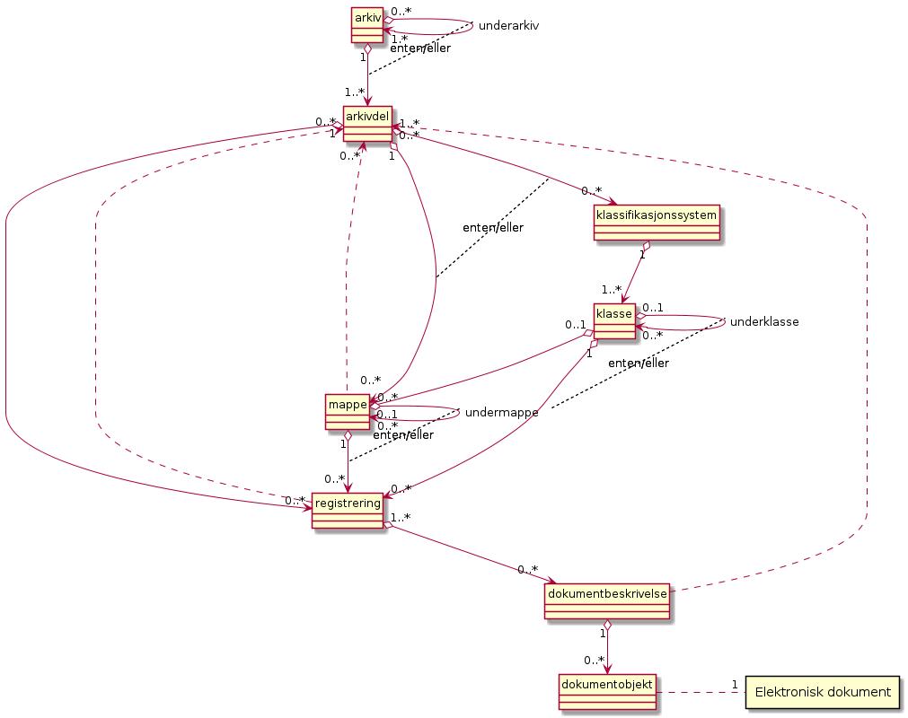

   **Overordnet skisse av den konseptuelle modellen for Noark 5**

Nivåene for *mappe* og *registrering* er bygd ut ved hjelp av spesialisering av klassene. Eksempler på slike spesialiseringer er *saksmappe* og *journalpost*. Den arkivstrukturen som er skissert gjennom den konseptuelle modellen i dette kapitlet, utgjør hovedstrukturen i Noark 5 og er obligatorisk for sakarkiver.

I enkelte system kan det være behov for en forenklet struktur, og visse nivå i strukturen kan utgå dersom det ikke er behov for nivået.

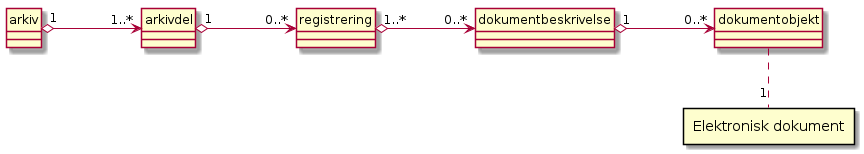

   **Forenklet arkivstruktur**

I et elektronisk arkiv eksisterer ikke mappene som fysiske enheter. Arkivstrukturen i et elektronisk arkiv er bygd opp av forskjellige metadata. Hver enhet i strukturen har sine bestemte metadata, og de forskjellige nivåene er også koblet sammen med metadata. Metadata er altså aggregert på flere nivåer, slik at metadata på øverste nivå vil være knyttet til alle dokumenter i arkivet, mens metadata på laveste nivå bare er knyttet til et enkeltdokument.

.. list-table:: **Overordnede krav til arkivstrukturen**
   :widths: 1 8 1 4
   :header-rows: 1

 * - Krav nr.
   - Overordnede krav til arkivstrukturen
   - Type
   - Merknad
 * - 2.1.1
   - For at en løsning skal kunne godkjennes etter Noark 5 må den
     konseptuelle modellen av arkivstrukturen og de funksjonelle
     muligheter den gir, kunne implementeres i det aktuelle systemets
     (fysiske) datastrukturer.
   - O
   - Innebærer at det må implementeres slik at data skal kunne
     presenteres og hentes ut på den måten.
 * - 2.1.2
   - Arkivdokumenter skal inngå i en arkivstruktur som minst
     inneholder følgende arkivenheter:

     *arkiv*, *arkivdel*, *registrering*, *dokumentbeskrivelse* og
     *dokumentobjekt*.
   - O
   -
 * - 2.1.3
   - Journalføringspliktige saksdokumenter skal inngå i et sakarkiv,
     med en arkivstruktur som minst skal inneholde følgende
     arkivenheter:

     *arkiv*, *arkivdel*, *klassifikasjonssystem*, *klasse*, *mappe*,
     *registrering*, *dokumentbeskrivelse* og *dokumentobjekt*.
   - B
   - Obligatorisk for sakarkiver.
 * - 2.1.4
   - For fysiske arkiver kan *dokumentobjekt* utgå.
   - V
   -

Metadata
--------

Metadata er informasjon som beskriver dokumentene i arkivet, både fysiske og elektroniske dokumenter. Metadata tilføres dokumentene først og fremst under dokumentfangsten. Noe av dette vil skje manuelt, men mye skjer også automatisk. En del metadata skal fryses straks de er registrert, og etter at dokumentene er endelig arkivert skal de fleste metadata bare kunne endres av spesielt autoriserte brukere.

Metadata har flere viktige funksjoner. Det er metadataene som binder dokumentene til den konteksten de er skapt i. Metadataene sikrer de elektroniske dokumentenes autentisitet og dermed deres bevisverdi. Uten metadata vil ikke dokumenter ha verdi som *arkivdokumenter*. Metadata er også viktig for fremfinning, tilgangsstyring og skjerming, i tillegg til å styre bevaring og kassasjon, dvs. en kontrollert sletting av alle dokumenter som har en begrenset oppbevaringstid.

Det er viktig at metadataene som benyttes faktisk reflekterer måten man utfører saksbehandlingen på og hva man reelt sett har behov for å dokumentere. I Noark 5 er det svært stor fleksibilitet når det gjelder spesifisering av de metadata man trenger for å dokumentere arbeidsoppgavene slik de faktisk er utført. Standarden definerer metadata for uttrekket, og er ikke til hinder for at andre metadata brukes i løsningen. Metadatakatalogen skal ikke være begrensende for hvordan virksomheten spesifiserer sine egne dokumentasjonsbehov og -krav, men et grunnlag å bygge videre på. Dersom man bruker andre metadata må man definere hvordan de eventuelt skal inngå i uttrekket, om de lar seg passe inn i strukturen som virksomhetsspesifikke metadata.

I Noark 5 blir det definert metadata for alle nivåer i arkivstrukturen. Disse metadataene er nærmere spesifisert i vedlegg 1, *Metadatakatalog.* Mange av de samme meta­dataene vil opptre på forskjellige nivåer i arkivstrukturen, men de vil bare bli spesifisert én gang i katalogen.

Vedlegg 2 *Metadata gruppert på objekter* spesifiserer hvilke metadata som brukes på de ulike nivåene og objektene i arkivstrukturen, om de er obligatoriske eller valgfrie, og om de kan forekomme 0, 1 eller mange gang på et objekt. I den visuelle presentasjonen i dette dokumentet er obligatoriske metadata skrevet med fet skrift, mens valgfrie er skrevet med tynn skrift. Dersom det er konflikt mellom dette dokumentet og vedlegg 2, er det vedlegg 2 som er «fasiten.»

En arkivkjerne som kun dekker obligatoriske objekt i datamodellen og de obligatoriske metadata på disse objektene, kan dermed fremstilles slik:

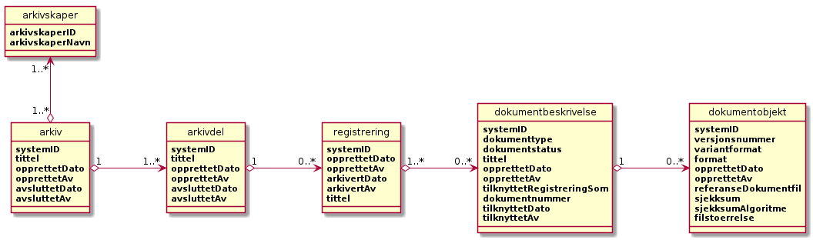

   **Arkivkjerne med obligatoriske krav**

Utgangspunktet for definisjonen av metadata har vært kravet til hva som skal inngå i et arkivuttrekk. Men det er også tatt hensyn til metadata som skal kunne utveksles elektronisk sammen med dokumenter, metadata som skal kunne deles ved integrasjon med fagsystemer, og metadata som skal kunne migreres til andre systemer sammen med tilhørende dokumenter.

Metadata blir navngitt på en entydig måte som er nærmere forklart i metadatakatalogen. Metadatanavnene er obligatoriske ved eksport og utveksling av data. Noen metadataelementer skal kunne *arves* fra en overordnet enhet til en underordnet.

Det er ikke noe krav at alle metadata i katalogen nødvendigvis må lagres i kjernen. I en del løsninger er det mer hensiktsmessig å lagre deler av metadata i fagsystemet. Men det er et krav at ved eksport eller utveksling skal alle obligatoriske metadata inngå i en felles struktur. Slike strukturer vil bl.a. bli beskrevet i form av XML-skjema i Noark 5.

.. list-table:: **Overordnede krav til metadata**
   :widths: 1 8 1 4
   :header-rows: 1

 * - Krav nr.
   - Overordnede krav til metadata
   - Type
   - Merknad
 * - 2.2.1
   - En Noark 5-løsning skal ha tjenester/funksjoner for å *lagre,
     gjenfinne, endre og slette* data og utvalg av data i henhold til
     metadatabeskrivelsene i alle *arkivenheter* og tilhørende klasser
     som er dokumentert i de konseptuelle modellene og
     metadatatabellene i Noark 5.
   - O
   - Funksjonelle enkeltkrav i de forskjellige kapitlene kan overstyre
     dette kravet.
 * - 2.2.2
   - En arkivenhet skal kunne identifiseres entydig innenfor det
     arkivskapende organet. I et arkivuttrekk skal denne
     identifikasjonen hete systemID, og være entydig på tvers av alle
     uttrekk som organet produserer, dermed også på tvers av alle
     systemer organet benytter. Også arkivenheter som dupliseres i et
     arkivuttrekk, skal identifiseres entydig, slik at identiske
     arkivenheter har ulik systemID.
   - O
   -

Arkiv og arkivdel
-----------------

Forskjellige virksomheter vil ha forskjellig behov for definering av arkiv og arkivdeler. Både arkiv og arkivdel obligatoriske nivå i arkivstrukturen.

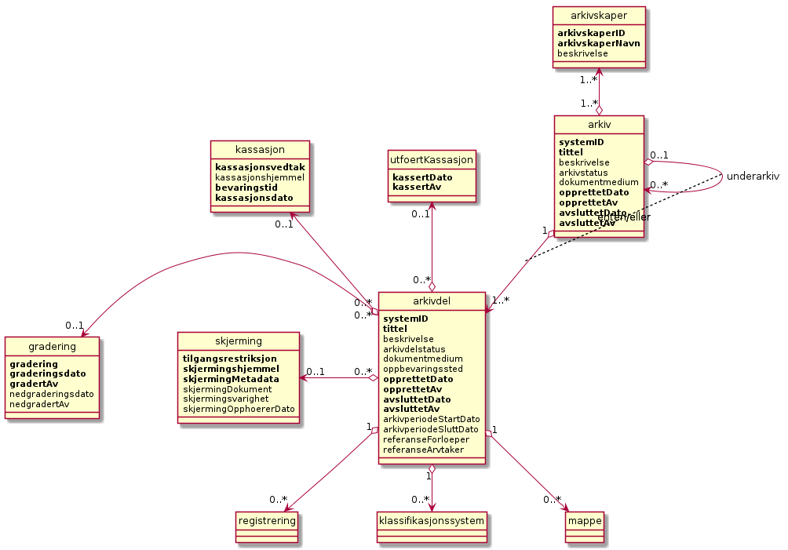

   **Konseptuell modell for *arkiv* og *arkivdel* **

Arkiv
~~~~~~

Et arkiv består normalt av dokumenter som blir til som ledd i én virksomhet, dvs. dokumenter som mottas eller produseres av en enkelt arkivskaper og samles som resultat av dennes virksomhet. Arkiv er det øverste nivået i arkivstrukturen. De fleste virksomheter vil kun ha behov for å opprette ett arkiv i sin Noark 5-løsning. Men det skal være mulig å opprette flere arkiver. Det kan være aktuelt dersom flere organ deler samme løsning. En Noark-løsning kan derfor omfatte ett eller flere arkiver.

Arkiv er obligatorisk i et arkivuttrekk.

Arkivskaper
~~~~~~~~~~~~

Tradisjonelt har et arkiv blitt definert etter *organisasjon*. En arkivskaper er en organisatorisk enhet eller en person som danner arkiv som ledd i sin virksomhet. En arkivskaper kan være et offentlig organ, en bedrift, en organisasjon, en institusjon, en stiftelse osv., eller en del av en slik enhet. Et offentlig organ kan være én arkivskaper og dermed ha ett arkiv (sentralisert arkiv), eller det kan utgjøre flere arkivskapere (avdelinger, etater i en kommune) som skaper hvert sitt arkiv (desentralisert arkiv).

Digitaliseringen har ført til at det blir stadig vanligere at flere arkivskapere sammen skaper ett arkiv. Arkivet vil da være definert etter *funksjon*, ikke organisasjon. I en Noark 5-løsning skal det derfor være mulig å knytte en eller flere arkivskapere til ett arkiv.

Informasjon om arkivskapere er obligatorisk i arkivuttrekk.

Underarkiv
~~~~~~~~~~

Det er i enkelte tilfeller behov for et ekstra nivå mellom arkiv og arkivdel. Det er særlig for fysiske arkiver innenfor kommunesektoren at det kan være behov for å dele opp arkiver i flere (fysiske) deler. Dette er løst ved å innføre såkalte underarkiv i den konseptuelle modellen. Underarkiv er en hierarkisk struktur innenfor arkivet og kan således defineres i flere nivåer. I praksis vil det vanligvis være ett nivå.

Underarkiv er ikke obligatorisk i arkivstrukturen.

Arkivdel
~~~~~~~~~

Et arkiv skal kunne deles opp i arkivdeler for å gruppere arkivet etter overordnede kriterier. De viktigste kriteriene for oppdeling i arkivdeler er:

-  Skille mellom aktivt arkiv og avsluttede arkivperioder. Funksjoner for periodisering og produksjon av arkivuttrekk er knyttet til en arkivdel.

-  Skille mellom mapper som skal periodiseres etter forskjellige prinsipper.

-  Skille mellom saksmapper som er klassifisert etter forskjellige prinsipper.

-  Skille mellom elektronisk arkiv og fysisk arkiv.

-  Skille mellom sakarkivet og andre typer arkiver, f.eks. arkiver tilknyttet fagsystemer. Noen vil ha behov for et klart skille mellom de administrative sakene og fagsakene. Det kan også være et behov for å skille ut møtedokumenter.

-  Skille mellom mapper, registreringer eller dokumenttyper som skal bevares eller som skal kasseres.

-  Skille mellom mapper, registreringer eller dokumenttyper som er offentlige eller som skal skjermes.

.. list-table:: **Funksjonelle krav til arkiv**
   :widths: 1 8 1 4
   :header-rows: 1

 * - Krav nr.
   - Funksjonelle krav til *arkiv*
   - Type
   - Merknad
 * - 2.3.1
   - Dersom *arkiv* er registrert som «avsluttet», skal det ikke være
     mulig å legge til flere underliggende *arkivdeler*.
   - B
   - Obligatorisk dersom arkivstatus brukes.
 * - 2.3.2
   - Når en tjeneste/funksjon sletter et helt *arkiv* med alle
     underliggende nivå, skal dette logges.
   - O
   -

.. list-table:: **Funksjonelle krav til underarkiv**
   :widths: 1 8 1 4
   :header-rows: 1

 * - Krav nr.
   - Funksjonelle krav til *underarkiv*
   - Type
   - Merknad
 * - 2.3.3
   - Systemet bør ha en tjeneste/funksjon for å angi et *arkiv* som
     *underarkiv* til et *arkiv*.
   - V
   - 
 * - 2.3.4
   - Et *underarkiv* skal kun opprettes og endres gjennom
     Administrasjonssystemet for Noark 5.
   - B
   - Obligatorisk dersom underarkiv brukes.

.. list-table:: **Funksjonelle krav til arkivdel**
   :widths: 1 8 1 4
   :header-rows: 1

 * - Krav nr.
   - Funksjonelle krav til *arkivdel*
   - Type
   - Merknad
 * - 2.3.5
   - Når en tjeneste/funksjon sletter en *arkivdel,* skal dette
     logges.
   - O
   - 
 * - 2.3.6
   - Dersom *arkivdel* er registrert som avsluttet (avsluttetDato er
     satt) skal det *ikke* være mulig å legge til flere tilhørende
     *mapper* eller *registreringer*.
   - O
   - 

Klassifikasjonssystem og klasse
-------------------------------

Klassifikasjonssystem
~~~~~~~~~~~~~~~~~~~~~

Alle offentlige organ skal lage en oversikt over sine saksområder, og ordne og beskrive disse i et klassifikasjonssystem. Et klassifikasjonssystem består med andre ord av klasser som først og fremst beskriver arkivskapers funksjoner, prosesser og aktiviteter. Men det kan også brukes til å beskrive emner eller objekter. I norsk arkivtradisjon har klassifikasjonssystem normalt vært omtalt som arkivnøkler, dvs. system for ordning av sakarkiv, og hovedsystemet har vært ordning etter emne.

I henhold til ISO 15489 og 30300 er klassifikasjon den systematiske identifikasjonen og ordningen av forretningsaktiviteter og/eller registreringer (informasjonsobjekter) i kategorier i henhold til logisk strukturerte konvensjoner, metoder og prosedyreregler fremstilt i et klassifikasjonssystem.

Alle virksomheter utøver et bestemt antall *funksjoner*. Disse er ofte stabile over tid, men funksjoner kan overføres fra en virksomhet til en annen. Funksjoner/underfunksjoner består av ulike prosesser (eller grupper av prosesser), som igjen kan deles inn i *aktiviteter*. I motsetning til en funksjon, har en prosess en begynnelse og en slutt. En prosess har ofte også deltakere, og den fører til et resultat. Alle dokumenter som produseres når en prosess utføres, skal normalt tilhøre samme (saks)mappe. Prosesser kan deles opp i forskjellige aktiviteter, eller *transaksjoner*. Det er transaksjoner som skaper arkivdokumenter (records). Typiske transaksjoner er mottak av en søknad i form av et inngående dokument, og vedtaket i form av et utgående dokument.

Dette hierarkiet av funksjoner, prosesser og aktiviteter skal gjenspeiles i et funksjonsbasert klassifikasjonssystem. Stort sett vil dette kunne tilsvare det som kalles "emnebasert" klassifikasjon. Men det er litt feil å snakke om emne i stedet for funksjon. Et emne vil si noe om *hva et objekt inneholder* eller *handler om*, mens en funksjon vil si noe om *hvorfor et objekt har blitt til*.

Det er mange grunner til å organisere et arkiv etter et funksjonsbasert klassifikasjonssystem:

-  Dokumenter som har blitt til som resultat av aktiviteter som hører sammen (prosessene) blir knyttet sammen. Dette tilfører dokumentene viktig kontekstuell informasjon.

-  Gjenfinning av mapper og dokumenter forenkles.

-  Kan styre tilgangen til dokumentene. Bestemte klasser kan f.eks. inneholde dokumenter som må skjermes.

-  Kan være et utgangspunkt for bevaring og kassasjon. Det er i dag allment akseptert at kassasjonsvedtak bør baseres på virksomhetens funksjoner, prosesser og aktiviteter, og ikke på dokumentenes innhold.

Den andre hovedtypen av klassifikasjonssystemer er *objektbasert* klassifikasjon. "Objektene" vil ofte være personer, men kan også være virksomheter, eiendommer o.l. I motsetning til funksjonsbaserte klassifikasjonssystemer, er objektbaserte systemer ofte flate - dvs. de består av bare ett nivå.

Funksjonsbasert klassifikasjon og objektbasert klassifikasjon vil oftest tilhøre to forskjellige klassifikasjonssystemer. Men det er også tillatt å blande disse to i ett og samme klassifikasjonssystem.

Ved fysisk arkivering skal klassifikasjonssystemet gjenspeile dokumentenes fysiske ordning. Her fungerer klassifikasjonssystemet som et hjelpemiddel til å finne fram i papirdokumentene.

Klasse
~~~~~~

Et klassifikasjonssystem er bygd opp av klasser. Ved funksjonsbasert (emnebasert) klassifikasjon vil klassene vanligvis inngå i et hierarki, hvor tre eller fire nivåer er det vanlige. I den konseptuelle modellen er undernivåene kalt underklasser, og fremkommer som en egenrelasjon i klasse.

Klassene skal ha en egen identifikasjon som er unik innenfor klassifikasjonssystemet. Dette tilsvarer det som er kalt *ordningsverdi* eller *arkivkode* i Noark-4. Identifikasjoner fra overordnede klasser skal arves nedover i hierarkiet, slik at det er lett å si hvilket nivå en befinner seg på.

Ved objektbasert klassifikasjon med bare ett nivå, kan identifikasjonen f.eks. være fødselsnummer eller gårds- og bruksnummer.

Det skal være mulig å klassifisere en saksmappe med mer enn en klasse, dvs. med en eller flere *sekundære klassifikasjoner.* Dette muliggjør da bruk av sekundære arkivkoder og mangefasettert klassifikasjon, f.eks. K-kodene som brukes i mange kommuner. I den konseptuelle modellen for mappe er dette illustrert med en egen klasse. Men all arv av metadata kan kun gå gjennom den *primære klassifikasjonen*.

Klassene vil ofte legges inn før en Noark 5-løsning tas i bruk. Men det skal også være mulig for autoriserte brukere å opprette nye klasser. Det er særlig aktuelt ved objektbasert klassifikasjon. Klasser skal også kunne avsluttes, slik at det ikke lenger er mulig å knytte nye mapper til dem.

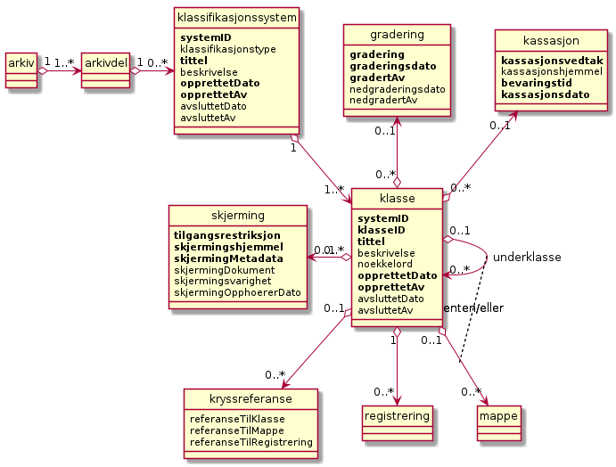

   **Konseptuell modell for *klassifikasjonssystem* **

Klassifikasjonssystem
************************

Klassifikasjonssystemet beskriver den overordnede strukturen for mappene i én eller flere arkivdeler.

Klasse
*******

Et klassifikasjonssystem er bygd opp av klasser. En klasse skal bestå av en *klasseID,* som angir tillatte verdier i klassifikasjonssystemet og en *klassetittel*, som er en tekstlig beskrivelse av funksjonen eller prosessen.

.. list-table:: **Funksjonelle krav til klassifikasjonssystem**
   :widths: 1 8 1 4
   :header-rows: 1

 * - Krav nr.
   - Funksjonelle krav til *klassifikasjonssystem*
   - Type
   - Merknad
 * - 2.4.1
   - Det skal være mulig å etablere hierarkiske klassifikasjonssystem.
   - B
   - Obligatorisk for sakarkiv
 * - 2.4.2
   - Det skal være mulig å etablere fasetterte, hierarkiske
     klassifikasjonssystem. Følgende er standard:
     
     - K-kodenøkkelen
   - B
   - Obligatorisk for sakarkiver i kommunesektoren.
 * - 2.4.3
   - Det skal være mulig å etablere endimensjonale
     klassifikasjonssystem.  Følgende er standard:
     
     - Juridisk person (privatperson eller næring)
     - Gårds- og bruksnummer
   - B
   - Obligatorisk for sakarkiv

.. list-table:: **Funksjonelle krav til klasse**
   :widths: 1 8 1 4
   :header-rows: 1

 * - Krav nr.
   - Funksjonelle krav til *klasse*
   - Type
   - Merknad
 * - 2.4.4
   - For at en *klasse* skal kunne tilordnes en *mappe*, må den ligge
     på nederste nivå i klassehierarkiet.
   - B
   - Obligatorisk for sakarkiv.
 * - 2.4.5
   - Dersom verdien i *klasse* er registrert som avsluttet
     (avsluttetDato), skal det ikke være mulig å tilordne nye *mapper*
     til *klassen.*
   - B
   - Obligatorisk dersom det er mulig å avslutte klasser.
 * - 2.4.6
   - Bare autorisert personale kan opprette klasser. Andre brukere kan
     gis tillatelse til å opprette klasser.
   - B
   - Obligatorisk for sakarkiv.

Mappe
-----

En mappe grupperer dokument som på en eller annen måte hører sammen.

Noark 5 legger til rette for en fleksibel bruk av mapper. Grunnen til dette er at det skal være mulig å innpasse dokument som mottas og skapes i de fleste typer system i kjernen.

En *sak* i Noark-4 utgjør en bestemt mappetype i Noark 5, nemlig *saksmappe*. Dersom et system basert på Noark 5 bare skal brukes for sakarkiver, er det ikke noe i veien for å bruke begrepet "sak" i alle grensesnitt mot brukerne, på samme måte som i Noark-4. Men i denne standarden er mappe det generelle begrepet for arkivenheten på dette nivået.

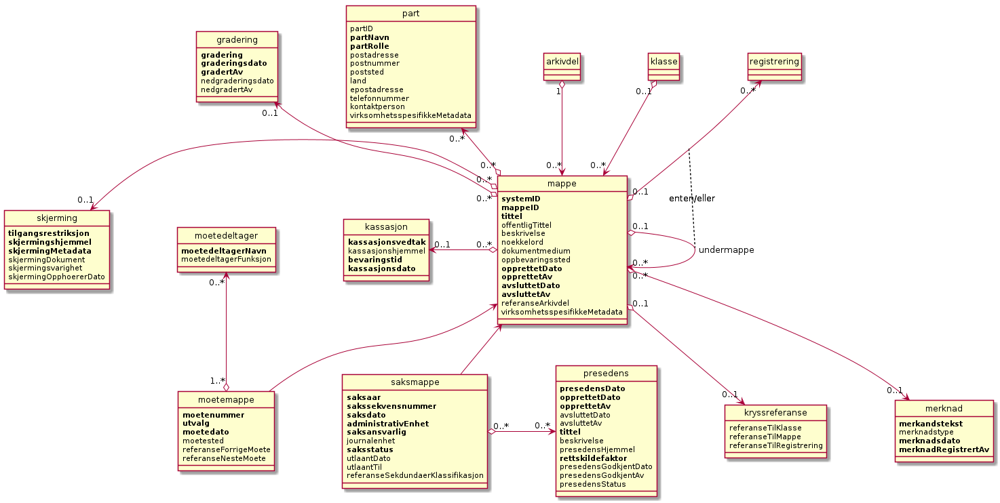

   **Konseptuell modell for *mappe* **

**Mappe**

Utgangspunktet for alle mappetyper i Noark 5 er metadataene i en *mappe*. Denne inneholder noen grunnleggende metadata, men det er ikke alle metadata her som er obligatoriske. En del spesialiserte system vil trenge ekstra metadata i tillegg til dette. Dette kan løses enten ved bruk av *virksomhetsspesifikke metadata*, eller ved å lage andre spesialiserte av mappetyper med utgangspunkt i mappe eller Saksmappe.

**Undermappe**

En mappe kan inneholde en eller flere undermapper (spesifisert som egenrelasjon i *mappe*). Arv fra en klasse vil alltid gå til mappen på det øverste nivået. Dersom mappenivået består av flere nivåer, skal registreringer bare kunne knyttes til det laveste nivået. En mappe kan altså ikke inneholde både andre mapper og registreringer.

**Saksmappe**

Journalføringspliktige dokument skal alltid legges i spesialiseringen *Saksmappe*, og saksmapper disse skal alltid være knyttet til en klasse. Mappene skal også ha referanse til hvilken arkivdel de tilhører, selv om dette også kan avledes av tilhørigheten til klasse og klassifikasjonssystem. Saksmappen inneholder metadata fra *mappe* i tillegg til egne metadata. En saksmappe er bakoverkompatibel med en sak i Noark-4, men har en del nye metadata.

For sakarkiver er det obligatorisk å bruke en saksmappe.

**Møtemappe**

Dokumenter som produseres i forbindelse med faste møter bør samles i *Møtemapper*. Dette er mest aktuelt brukt for kommunale utvalgsmøter, styremøter, ledermøter, mv., hvor det er flere møtesaker som tas opp på hvert møte. Enkeltstående møtereferat, mv., til møter som avholdes i forbindelse med saker i den løpende saksbehandlingen, kan vel så gjerne arkiveres i aktuell saksmappe.

Metadata for møtedeltaker grupperes inn i metadata for møtemappe.

.. list-table:: **Strukturelle krav til mappe**
   :widths: 1 8 1 4
   :header-rows: 1

 * - Krav nr.
   - Strukturelle krav til *mappe*
   - Type
   - Merknad
 * - 2.5.1
   - En *mappe* skal kunne være av forskjellig type.
     
     *Dette er i den konseptuelle modellen løst gjennom
      spesialisering*.
   - O
   - 
 * - 2.5.2
   - En *mappe* som inneholder *journalposter* skal være en
     *saksmappe*.
   - B
   - Obligatorisk for sakarkiv
 * - 2.5.3
   - En *mappe* som inneholder møteregistreringer bør være en
     *møtemappe*
   - V
   - 
 * - 2.5.4
   - Det bør være mulig å definere relevante tilleggsmetadata for
     *møtemappe* i tillegg til de metadataene som er definert i
     standarden.
   - V
   - 
 * - 2.5.5
   - Dersom en *mappe* er registrert som avsluttet (avsluttetDato)
     skal det ikke være mulig å legge flere *registreringer* til
     *mappen*.
   - O
   - 

.. list-table:: **Funksjonelle krav til mappe**
   :widths: 1 8 1 4
   :header-rows: 1

 * - Krav nr.
   - Funksjonelle krav til *mappe*
   - Type
   - Merknad
 * - 2.5.6
   - Dersom det er angitt et primært klassifikasjonssystem for
     *arkivdel*, skal alle *mapper* i arkivdelen ha verdier fra dette
     klassifikasjonssystemet som primær klasse.
   - B
   - Obligatorisk dersom primært klassifikasjonssystem er angitt for
     arkivedel.

Registrering
------------

En *registrering* tilsvarer "record" eller "dokumentasjon" i ISO-standarder, og utgjør arkivenes primære byggeklosser. En aktivitet kan deles opp i flere trinn som vi kaller *transaksjoner*. En transaksjon innebærer normalt at minst to personer eller enheter må være involvert, men det behøver ikke alltid være tilfelle. Vi bruker likevel begrepet transaksjon generelt for alle trinn en aktivitet kan deles opp i. Det er transaksjoner som genererer *arkivdokumenter,* og arkivdokumentet er dokumentasjon på at transaksjonen er utført.

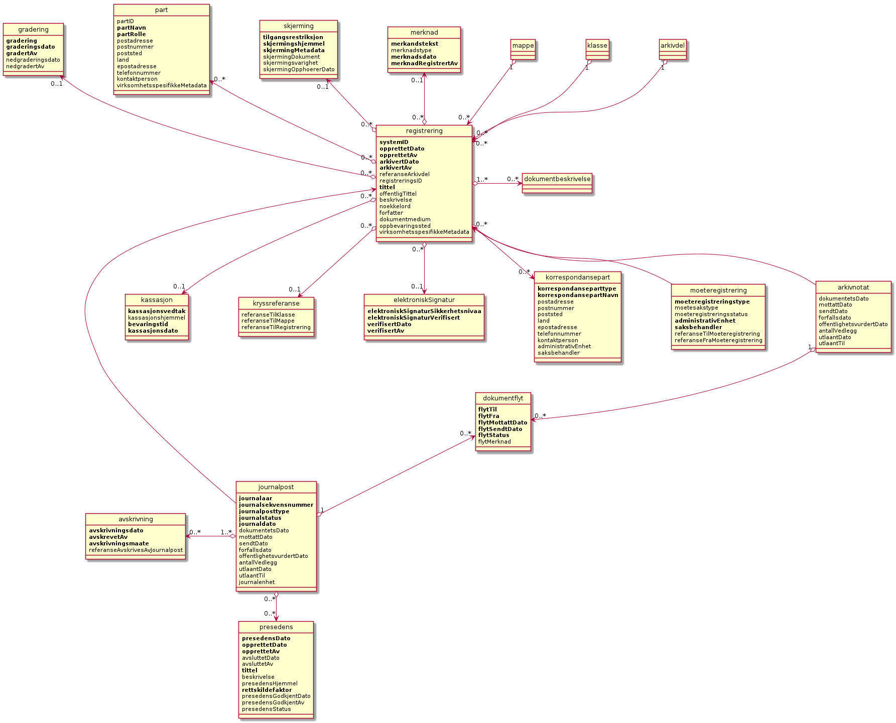

   **Konseptuell modell for *registrering* **

**Registrering**

På samme måte som Noark 5 er fleksibel når det gjelder mappenivået, er standarden også fleksibel når det gjelder registreringsnivået. Det er ikke alle system som trenger like mye metadata på dette nivået. En registrering inneholder de metadata man anser nødvendig for å kunne arkivere dokumenter og metadata i alle typer systemer. En registrering danner utgangspunkt for alle andre registreringstyper. [3]_

**Journalpost**

En *journalpost* representer en "innføring i journalen". Journalen er en kronologisk fortegnelse over inn- og utgående dokumenter (dvs. korrespondansedokumenter) brukt i saksbehandlingen, og eventuelt også organinterne dokumenter som journalføres.

Registreringstypen *journalpost* er obligatorisk for sakarkiver, og journalposter skal alltid legges i saksmapper. Alle *journalføringspliktige* dokumenter i offentlig forvaltning skal registreres som journalposter og inngå i et sakarkiv.

**Arkivnotat**

*Arkivnotat* er en registreringstype som brukes i sakarkiver for arkivering uten journalføring. [4]_ Arkivnotat har en del fellestrekk med journalpost ved at den har obligatorisk tilknytning til en saksmappe, og den kan tilknyttes dokumentflyt og andre interne behandlingsprosesser.

Arkivnotat kan benyttes på samme måte som man tidligere har brukt organinterne journalposttyper, men uten at registreringen skal tas med på offentlig journal. Forutsetningen er selvsagt at virksomheten oppfyller bestemmelsenes øvrige krav om journalføring for visse typer interne dokumenter.

**Møteregistrering**

En tredje type spesialisering er *møteregistrering,* som skal knyttes til en *møtemappe*. En møteregistrering vil inneholde dokumenter produsert i forbindelse med at det har blitt avholdt et møte.

**Korrespondansepart**

Korrespondansepart er obligatorisk for journalpost, og kan forekomme en eller flere ganger, men kan også være aktuelt å registrere på andre typer registreringer. Ved inngående dokumenter registreres avsender(e), ved utgående dokumenter mottaker(e). Ved organinterne dokumenter som skal følges opp, registreres både avsender(e) og mottaker(e).

.. list-table:: **Strukturelle krav til registrering**
   :widths: 1 8 1 4
   :header-rows: 1

 * - Krav nr.
   - Strukturelle krav til *registrering*
   - Type
   - Merknad
 * - 2.6.1
   - En *registrering* skal kunne være av forskjellig type.
     
     *Dette er i den konseptuelle modellen løst gjennom
     spesialisering.*
   - O
   - 
 * - 2.6.2
   - Registrering av journalføringspliktige dokumenter skal løses
     gjennom *journalpost*.
   - B
   - Obligatorisk for sakarkiver.
 * - 2.6.3
   - *Registrering* av typen *journalpost* skal ha
     *korrespondansepart*.
   - B
   - Obligatorisk for sakarkiver.
 * - 2.6.4
   - Arkivering av saksdokumenter som ikke skal journalføres skal
     løses gjennom *registrering* av typen *arkivnotat*.
   - B
   - Obligatorisk for arkivering uten journalføring i sakarkiver.
 * - 2.6.5
   - Registrering av møtedokumenter bør løses gjennom
     *møteregistrering*.
   - V
   - 
 * - 2.6.6
   - Det bør være mulig å definere relevante tilleggsmetadata for
     *møteregistrering* i tillegg til de metadataene som er definert i
     standarden.
   - V
   - 
 * - 2.6.7
   - Dersom en *registrering* er registrert som arkivert
     (avsluttetDato er satt) skal det ikke være mulig å legge flere
     *dokumentbeskrivelser* til *registreringen*.
   - O
   - 

Dokumentbeskrivelse og dokumentobjekt
-------------------------------------

En *registrering* er altså en arkivenhet som består av metadata som beskriver et innhold. Det er innholdet som utgjør «dokumentet». Et dokument er et informasjonsobjekt som kan behandles som en enhet, men som kan bestå av ulike komponenter eller ha ulike representasjoner. I Noark 5 brukes *dokumentbeskrivelse* og *dokumentobjekt* for å skille på dette.

I en relasjonsdatabase vil det typisk være et mange-til-mange-forhold mellom registrering og dokumentbeskrivelse. Ved deponering/avlevering skal imidlertid metadata både for dokumentbeskrivelse og dokumentobjekt dupliseres for hver gang det samme dokumentet er knyttet til forskjellige registreringer. I tillegg skal dokumentobjektet ha informasjon om når dokumentet ble knyttet til registreringen, hvilken "rolle" dokumentet har i forhold til registreringen (hoveddokument eller vedlegg), rekkefølgenummer osv. Dette vil være unik informasjon for hver tilknytning (i Noark-4 ble attributtene for dette beskrevet i en tabell kalt Dokumentlink). Hver dokumentbeskrivelse skal derfor ha en unik *systemID*.

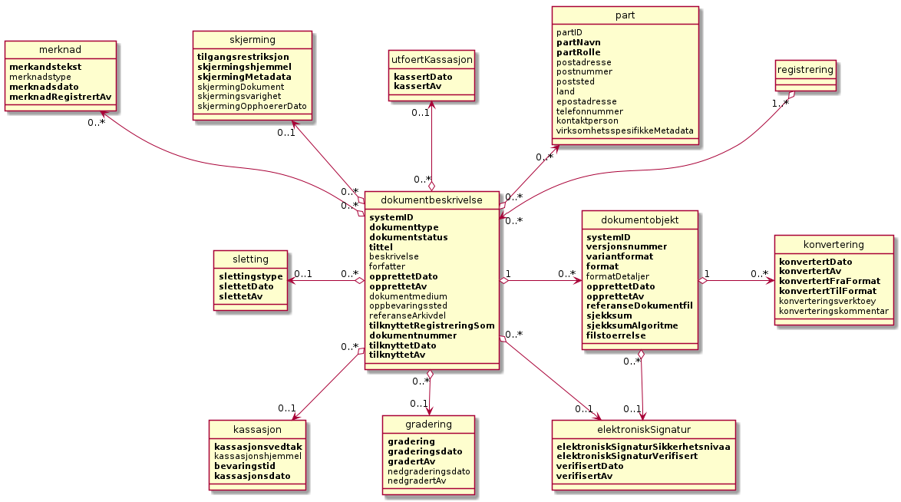

   **Konseptuell modell for *dokumentbeskrivelse* og *dokumentobjekt* **

**Dokumentbeskrivelse**

Den vanligste bruken av *dokumentbeskrivelse* er for å skille mellom hoveddokument og vedlegg, hvor hoveddokumentet og hvert av vedleggene utgjør hvert sitt enkeltdokument. [5]_ Ett dokument kan være knyttet til flere journalposter som hoveddokument.

**Dokumentobjekt**

Dokumentobjekt er det laveste metadatanivået i arkivstrukturen. Et dokumentobjekt skal referere til én og kun en *dokumentfil.* Dokumentfila inneholder selve dokumentet. Dersom dokumentet er arkivert i flere *versjoner*, må vi ha et dokumentobjekt og en dokumentfil for hver versjon. Hver versjon av dokumentet kan dessuten arkiveres i flere forskjellige *formater*, og da må det i tillegg opprettes egne dokumentobjekter og dokumentfiler for hvert format. I noen tilfeller kan det også være aktuelt å lage *varianter* av enkelte dokumenter. Den mest vanlige varianten vil være et "sladdet" dokument hvor taushetsbelagt informasjon er fjernet slik at varianten kan være offentlig tilgjengelig. Dokumentobjektet inneholder mer tekniske metadata enn de andre arkivenhetene, bl.a. sjekksummen til bytesekvensen som representerer dokumentet.

Verdier i formatfeltene (M701, M712, M713) hentes fra
PRONOM-registeret over formater fra det britiske nasjonalarkivet.
Informasjon om PRONOM er tilgjengelig fra deres nettsider,
``https://www.nationalarchives.gov.uk/PRONOM/``.  Slike formatverdier
består at et prefiks "fmt" eller "x-fmt", en skråstrek og et heltall,
for eksempel "fmt/13" (PNG) og "x-fmt/18" (CSV).

Ved bruk av formater som ikke har fått PRONOM-verdi, bør det brukes en
midlertidig formatverdi. Det er definert to slike sett med
midlertidige formatverdier. Offisielle midlertidige formatverdier
registrert i regi av Arkivverket har prefiks "av/", mens midlertidige
formatverdier fastsatt av arkivskaper gis prefiks "vnd/". For å
identifisere ukjente formater som arkivsystemet ikke kjenner igjen
skal verdi "av/0" brukes.  Formatet til filer med formatkode "av/0" må
identifiseres og få spesifikke formatkoder før deponering og
avlevering.  For mer informasjon om formatverdier og autorativ liste
over både permanente og midlertidige, se tillegg D i spesifikasjonen
for Noark 5 Tjenestegrensesnitt.

Før en tar i bruk en lokalt definert verdi (med prefix "vnd/"), så bør
en sjekke om formatet allerede er registrert i formatkatalogen, og
bruke formatverdi derfra hvis mulig. Når et format med midlertidig
formatverdi får en offisiell formatverdi fra PRONOM, så skal
verdiliste og oppføringer i arkivsystemet oppdateres ved første
praktiske anledning, maksimalt et år etter at slik verdi er tildelt av
PRONOM, dog aldri senere enn i forkant av eventuell deponering og
avlevering av arkivmaterialet der slike verdier blir brukt.

.. list-table:: **Strukturelle krav til dokumentbeskrivelse og dokumentobjekt**
   :widths: 1 8 1 4
   :header-rows: 1

 * - Krav nr.
   - Strukturelle krav til *dokumentbeskrivelse* og *dokumentobjekt*
   - Type
   - Merknad
 * - 2.7.1
   - Et *dokumentobjekt* som er tilknyttet samme *dokumentbeskrivelse*
     skal kunne referere til forskjellige *versjoner* av dokumentet.
   - O
   - 
 * - 2.7.2
   - Et *dokumentobjekt* som er tilknyttet samme *dokumentbeskrivelse*
     skal kunne referere til forskjellige *varianter* av et dokument.
   - O
   - 
 * - 2.7.3
   - Et *dokumentobjekt* som er tilknyttet samme *dokumentbeskrivelse*
     skal kunne referere til samme dokument lagret i forskjellig
     *format*.
   - O
   - 

.. list-table:: **Funksjonelle krav til dokumentbeskrivelse og dokumentobjekt**
   :widths: 1 8 1 4
   :header-rows: 1

 * - Krav nr.
   - Funksjonelle krav til *dokumentbeskrivelse* og *dokumentobjekt*
   - Type
   - Merknad
 * - 2.7.4
   - Det skal finnes funksjoner som ved opprettelse av nytt dokument
     skal knytte dette til en *dokumentbeskrivelse*.
   - O
   - 
 * - 2.7.5
   - Det skal være mulig å opprette en *dokumentbeskrivelse* uten
     elektronisk dokument.
   - O
   - 
 * - 2.7.6
   - Det skal finnes en funksjon/tjeneste for å arkivere en eller
     flere versjoner/varianter/formater av et dokument.
   - O
   - 
 * - 2.7.7
   - Det skal ikke være mulig å slette et arkivert dokument. Eldre
     versjoner av dokumentet skal likevel kunne slettes.
   - O
   - 
 * - 2.7.8
   - Ved tilknytning av et dokument til en *registrering*, skal det
     kunne angis om det er et hoveddokument eller et vedlegg
     (tilknyttetRegistreringSom).
   - O
   - 

Konvertering til arkivformat
~~~~~~~~~~~~~~~~~~~~~~~~~~~~

Alle arkivdokumenter som skal avleveres må være i arkivformat. Konvertering til arkivformat skal foretas senest ved avslutning av mappe. Systemet skal logge alle konverteringer, og informasjon om dette skal tas med ved deponering/avlevering.

Som del av konvertering bør det logges sjekksum for filen det ble
konvertert fra (fra-filen), og filen det ble konvertert til
(til-filen), som kan brukes til å dokumentere konverteringskjeden.

.. list-table:: **Krav til konvertering til arkivformat**
   :widths: 1 8 1 4
   :header-rows: 1

 * - Krav nr.
   - Krav til konvertering til *arkivformat*
   - Type
   - Merknad
 * - 2.7.9
   - Det skal finnes en tjeneste/funksjon som gjør det mulig for
     arkivadministrator å angi hvilke dokumentformater som er definert
     som arkivformater.
   - O
   - 
 * - 2.7.10
   - Det skal finnes en tjeneste/funksjon som gjør at
     arkivadministrator kan sette opp regler for når (hvilke statuser)
     arkivdokumenter skal konverteres til arkivformat.
   - O
   - 
 * - 2.7.11
   - Det skal være konfigurerbart om dokumenter skal konverteres til
     arkivformat når status på dokumentbeskrivelse settes til
     «Dokumentet er ferdigstilt».
   - O
   - 
 * - 2.7.12
   - Det skal være konfigurerbart om alle eller spesielt merkede
     versjoner skal konverteres til arkivformat.
   - O
   - 
 * - 2.7.13
   - Det skal finnes en tjeneste/funksjon og rapportering for
     filformattesting av dokumentene som er lagret i
     kjernen. Rapporten skal gi oversikt over hvilke mapper,
     registreringer og/eller dokumentbeskrivelser som ikke inneholder
     dokumenter lagret i godkjent arkivformat.
   - O
   -
 * - 2.7.26
   - For hver konvertering bør det registreres sjekksum for fra-filen
     og til-filen, slik at kjeden av konverteringer dokumenteres.  Det
     brukes samme sjekksumalgoritme som i dokumentobjekt, slik at
     kjeden frem til arkivformat er dokumentert.
   - V
   - 

Sletting av versjoner, varianter og formater
~~~~~~~~~~~~~~~~~~~~~~~~~~~~~~~~~~~~~~~~~~~~

Et viktig krav i Noark 5 er at arkiverte elektroniske dokumenter ikke skal kunne slettes. Kontrollert sletting skal bare kunne foretas av autoriserte brukere i forbindelse med kassasjon.

Dessuten kan dokumenter slettes av autoriserte brukere dersom de er formelt avlevert til et arkivdepot. Det understrekes at dette siste bare gjelder avleverte dokumenter, ikke dokumenter som er deponert til arkivdepotet.

Dersom et dokument er arkivert i mer enn én versjon, skal det være mulig å slette de eldre versjonene. Vanligvis er det bare den siste, ferdiggjorte versjon som skal arkiveres. Men det kan også være aktuelt å arkivere tidligere versjoner dersom disse har dokumentasjonsverdi. Det kan f.eks. være tilfelle dersom en leder har gjort vesentlige endringer i utkastet til en saksbehandler. Saksbehandlers utkast kan da arkiveres som en tidligere versjon av det ferdige dokumentet. Dette vil gi ekstra dokumentasjon om selve saksbehandlingsforløpet.

Dersom tidligere versjoner er blitt arkivert unødvendig, skal det være mulig å rydde opp på en effektiv måte. Slik opprydding skal alltid skje før det produseres et arkivuttrekk.

.. list-table:: **Krav til sletting av dokumentversjoner**
   :widths: 1 8 1 4
   :header-rows: 1

 * - Krav nr.
   - Krav til sletting av dokumentversjoner
   - Type
   - Merknad
 * - 2.7.14
   - Autoriserte brukere skal kunne slette en arkivert inaktiv
     dokumentversjon. Den siste, endelige versjonen skal ikke kunne
     slettes.
   - O
   - 
 * - 2.7.15
   - Det skal være mulig å søke fram dokumenter som er arkivert i
     flere versjoner.
   - O
   - 
 * - 2.7.16
   - Det bør være mulig å utføre sletting av mange inaktive
     dokumentversjoner samtidig, f.eks. alle inaktive
     dokumentversjoner som funnet etter et søk.
   - V
   - 
 * - 2.7.17
   - Sletting av arkiverte inaktive dokumentversjoner skal logges.
   - O
   - 
Dersom det opprinnelige dokumentet har innhold som skal skjermes, kan det lages en variant hvor opplysninger som skal skjermes, er fjernet. På den måten kan dokumentet likevel offentliggjøres. Slike varianter kan slettes dersom det ikke lenger er behov for dem. Det kan tenkes at det er aktuelt å avlevere dokumentvarianter, så sletting må vurderes i hvert enkelt tilfelle. Varianter som ikke er slettet når arkivuttrekket produseres, skal avleveres.

.. list-table:: **Krav til sletting av dokumentvarianter**
   :widths: 1 8 1 4
   :header-rows: 1

 * - Krav nr.
   - Krav til sletting av dokumentvarianter
   - Type
   - Merknad
 * - 2.7.18
   - Autoriserte brukere skal kunne slette en arkivert
     dokumentvariant. Det siste endelige dokumentet i arkivformat skal
     ikke kunne slettes.
   - O
   - 
 * - 2.7.19
   - Det skal være mulig å søke fram arkiverte dokumentvarianter.
   - O
   - 
 * - 2.7.20
   - Det bør være mulig å slette mange dokumentvarianter samtidig,
     f.eks. alle dokumentvarianter som er funnet etter et søk.
   - V
   - 
 * - 2.7.21
   - Sletting av arkiverte dokumentvarianter skal logges.
   - O
   - 

Alle dokumenter som skal avleveres, må være konvertert til et format godkjent av Riksarkivaren. [6]_ Det opprinnelige produksjonsformatet kan slettes, men kan etter nærmere avtale avleveres sammen med godkjent arkivformat.

.. list-table:: **Krav til sletting av dokumentformater**
   :widths: 1 8 1 4
   :header-rows: 1

 * - Krav nr.
   - Krav til sletting av dokumentformater
   - Type
   - Merknad
 * - 2.7.22
   - Autoriserte brukere skal kunne slette et arkivert dokument i
     produksjonsformat dersom dokumentet er blitt konvertert til
     arkivformat.  Dokumentet i arkivformat skal ikke kunne slettes.
   - O
   - 
 * - 2.7.23
   - Det skal være mulig å søke fram dokumenter arkivert i
     produksjonsformat.
   - O
   - 
 * - 2.7.24
   - Det bør være mulig å slette mange produksjonsformater samtidig,
     f.eks. alle produksjonsformater som er funnet etter et søk.
   - V
   - 
 * - 2.7.25
   - Sletting av arkiverte produksjonsformater skal logges.
   - O
   - 

Fellesfunksjonalitet til arkivstrukturen
----------------------------------------

Skjerming
~~~~~~~~~

Skjerming benyttes til å skjerme registrerte opplysninger eller enkeltdokumenter. Skjermingen trer i kraft når en tilgangskode påføres den enkelte mappe, registrering eller det enkelte dokument.

Løsningens brukere skal være klarert for bestemte tilgangskoder og autorisert for en nærmere definert del av de saker og journalposter med tilhørende dokumenter som er skjermet.

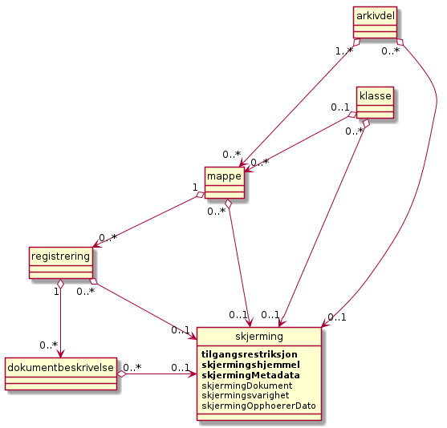

   **Konseptuell modell for *skjerming* **

.. list-table:: **Funksjonelle krav til skjerming**
   :widths: 1 8 1 4
   :header-rows: 1

 * - Krav nr.
   - Funksjonelle krav til *skjerming*
   - Type
   - Merknad
 * - 2.8.1
   - Skjerming bør kunne arves fra overordnet nivå til ett eller flere
     underliggende nivå i arkivstrukturen.
     
     Arvede verdier skal kunne overstyres.
   - V
   - 
 * - 2.8.2
   - Det skal finnes en tjeneste/funksjon for å skjerme *tittel* i
     *mappe* helt eller delvis.
   - O
   - 
 * - 2.8.3
   - Det skal finnes en tjeneste/funksjon for å skjerme *tittel* i en
     *registrering* helt eller delvis.
   - O
   - 

Nøkkelord
~~~~~~~~~

Det bør være mulig å føye ett eller flere nøkkelord til en *klasse*, en *mappe* eller en *registrering*. Nøkkelord må ikke blandes sammen med fasettert klassifikasjon basert på emneord. Mens *klassifikasjonen* normalt skal gi informasjon om dokumentets *kontekst* (hvilken funksjon som har skapt dokumentet), kan *nøkkelordene* brukes til å si noe om dokumentets *innhold*. Hensikten med nøkkelord er å forbedre søkemulighetene for en klasse, mappe eller registrering. Nøkkelord kan knyttes til en kontrollert ordliste (tesaurus). Det er ikke obligatorisk å implementere nøkkelord.

Nøkkelord er valgfritt, og kan forekomme en eller flere ganger i klasse, mappe eller registrering.

Kryssreferanse
~~~~~~~~~~~~~~

Dette er en referanse på tvers av hierarkiet i arkivstrukturen. Referansen kan gå fra en mappe til en annen mappe, fra en registrering til en annen registrering, fra en mappe til en registrering og fra en registrering til en mappe. Det kan også refereres fra en klasse til en annen klasse.

Kryssreferanse er valgfritt, og kan knyttes en eller flere ganger til klasse, mappe og registrering. Referansen går en vei, dvs. den kan kun være en referanse til en arkivenhet. I og med at kryssreferanser knyttes til mappe og registrering, vil det si at Referanser også knyttes til alle utvidelsene (spesialiseringer) under disse (Saksmappe, Møtemappe og Journalpost, Møteregistrering).

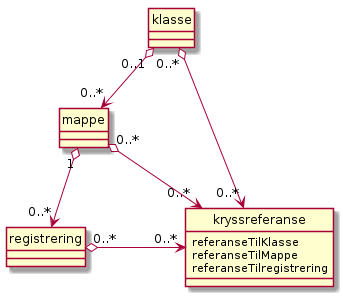

   **Konseptuell modell for *kryssreferanse* **

.. list-table:: **Funksjonelle krav til kryssreferanse**
   :widths: 1 8 1 4
   :header-rows: 1

 * - Krav nr.
   - Funksjonelle krav til *kryssreferanse*
   - Type
   - Merknad
 * - 2.8.4
   - Det skal finnes en tjeneste/funksjon som kan *lagre, gjenfinne,
     endre og slette* en kryssreferanse mellom:
     
     - Mapper
     - Registreringer
     
     eller til referanser mellom disse.
   - B
   - Obligatorisk for sakarkiv, aktuelt for mange fagsystemer.
 * - 2.8.5
   - Det bør finnes en tjeneste/funksjon som kan *lagre, gjenfinne,
     endre og slette* en kryssreferanse mellom:
     
     - Klasser
   - V
   - 

Merknad
~~~~~~~

En eller flere merknader skal kunne knyttes til en mappe, registrering eller en dokumentbeskrivelse. Merknader skal brukes for å dokumentere spesielle forhold rundt saksbehandlingen og arkivering av dokumenter, og denne informasjonen skal tas med i arkivuttrekket. Merknad kan for eksempel brukes til å dokumentere prosesstrinn knyttet til en (saks)mappe, registrering eller dokumentbeskrivelse som ikke nødvendigvis manifesterer seg som et dokument som skal bli en egen registrering.

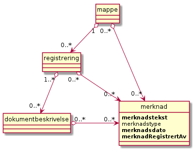

   **Konseptuell modell for *merknad* **

.. list-table:: **Funksjonelle krav til merknad**
   :widths: 1 8 1 4
   :header-rows: 1

 * - Krav nr.
   - Funksjonelle krav til *merknad*
   - Type
   - Merknad
 * - 2.8.6
   - Det skal finnes en tjeneste/funksjon som kan registrere en
     *merknad* til *mappe* eller *registrering*.
   - B
   - Obligatorisk for sakarkiv, aktuelt for mange fagsystemer.
 * - 2.8.7
   - Dersom mer enn én merknad er knyttet til en *mappe* eller en
     *registrering*, må metadataene grupperes sammen ved eksport og
     utveksling.
   - B
   - Obligatorisk for sakarkiv, aktuelt for mange fagsystemer.
 * - 2.8.8
   - Det bør være mulig fritt å definere typer merknader.
   - V
   - 

Part
~~~~

Det skal være mulig å knytte parter til mapper, registreringer eller dokumentbeskrivelser. [7]_ Partsbegrepet er juridisk, og har ulik betydning innen forvaltningsretten, privatretten og strafferetten. Innen forvaltningsretten er part «person som en avgjørelse retter seg mot eller som saken ellers direkte gjelder», mens det i strafferetten normalt bare er den som er anklaget for å ha begått en straffbar handling som er part i saken.

Noark 5 legger opp til at det er virksomhetens behov som styrer bruken av *part*, og en part kan være «hvem som helst» som virksomheten har behov for å registrere som interessent på en mappe, registrering eller dokumentbeskrivelse. Forutsetningen er at man definerer ulike roller for partene, som kan brukes til å styre ulike funksjoner, (innsyns)rettigheter, mv.

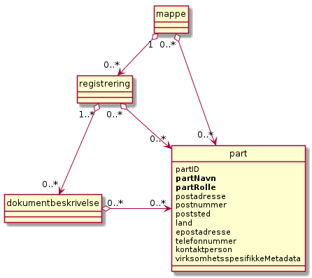

   **Konseptuell modell for *part* **

.. list-table:: **Krav til part**
   :widths: 1 8 1 4
   :header-rows: 1

 * - Krav nr.
   - Krav til *part*
   - Type
   - Merknad
 * - 2.8.9
   - Det skal være mulig å tilegne *mappe, registrering* eller
     *dokumentbeskrivelse* et fritt antall *part*.
   - B
   - Obligatorisk for løsninger hvor det inngår *parter*.
 * - 2.8.10
   - Det skal finnes en tjeneste/funksjon for å ajourholde *part* for
     *mappe*, *registrering* og *dokumentbeskrivelse*.
   - B
   - Obligatorisk for løsninger hvor det inngår *parter*.
 * - 2.8.11
   - *Part* skal kunne skjermes helt eller delvis
   - B
   - Obligatorisk for løsninger hvor det inngår *parter*.

Presedens
~~~~~~~~~

Med presedens menes en (retts)avgjørelse som siden kan tjene som rettesnor i lignende tilfeller eller saker. En presedens kan også være en sak som er regeldannende for behandling av tilsvarende saker. Det er som oftest snakk om et forvaltningsmessig vedtak, dvs. et enkeltvedtak fattet i henhold til det aktuelle organets forvaltningsområde, som inneholder en rettsoppfatning som senere blir lagt til grunn i andre lignende tilfeller. Prinsippavgjørelser knyttet til ulike saksområder skal derfor kunne etableres på en hensikts­messig måte og være tilgjengelig for saksbehandlere.

Man snakker vanligvis om presedenssaker, men det er vanligvis ett eller noen få av dokumentene i saken som danner presedens. Foruten å registrere hele saken, må derfor det eller de dokumentene som inneholder presedensavgjørelser kunne identifiseres. Hvis opplysninger om presedens er registrert, er presedens obligatorisk for avlevering.

.. figure:: ./media/uml-presedens-diagram.png
   :width: 80%

   **Konseptuell modell for *presedens* **

Noark 5 legger opp til at det skal kunne bygges opp et presedensregister med henvisninger til Saksmapper og Journalposter som danner presedens. Registeret bygges opp ved at presedensmetadata knyttes til de arkivenhetene (saker eller journalposter) som danner presedens.

.. list-table:: **Krav til presedens**
   :widths: 1 8 1 4
   :header-rows: 1

 * - Krav nr.
   - Krav til *presedens*
   - Type
   - Merknad
 * - 2.8.12
   - Det bør være mulig å opprette en presedens knyttet til en sak
     eller en journalpost.
   - V
   - 
 * - 2.8.13
   - Det bør være mulig å opprette et register over hvilke verdier man
     skal kunne velge presedensHjemmel fra.
   - V
   - 
 * - 2.8.14
   - Det skal være mulig å registrere tidligere presedenser,
     dvs. avgjørelser som ble tatt før man tok i bruk IKT-baserte
     løsninger for journalføring og arkivering.
   - B
   - Obligatorisk for løsninger hvor presedenser inngår.
 * - 2.8.15
   - Det skal være mulig å identifisere den eller de journalpostene i
     en saksmappe som inneholder presedensavgjørelsen.
   - B
   - Obligatorisk for løsninger hvor presedenser inngår.
 * - 2.8.16
   - Registrering, endring og tilgang til presedenser skal styres av
     tilgangsrettigheter.
   - B
   - Obligatorisk for løsninger hvor presedenser inngår.
 * - 2.8.17
   - Følgende statuser for *Presedens* er obligatoriske:
     
     - «Gjeldende»
     - «Foreldet»
   - B
   - Obligatorisk for løsninger hvor presedenser inngår.
 * - 2.8.18
   - Foreldede presedenser skal ikke kunne slettes.
   - B
   - Obligatorisk for løsninger hvor presedenser inngår.
 * - 2.8.19
   - Det skal ikke være mulig å slette en presedens selv om klassen
     som presedensen tilhører skal kasseres.
   - B
   - Obligatorisk for løsninger hvor presedenser inngår.
 * - 2.8.20
   - Det skal være mulig å etablere en samlet presedensoversikt i
     tilknytning til arkivstrukturen.
   - B
   - Obligatorisk for løsninger hvor presedenser inngår.
 * - 2.8.21
   - Det skal finnes en tjeneste/funksjon som gir mulighet for å få en
     fullstendig oversikt over alle presedenser.
   - B
   - Obligatorisk for løsninger hvor presedenser inngår.
 * - 2.8.22
   - Presedensvedtaket skal kunne presenteres i et offentlig dokument
     eller i en offentlig variant.
   - B
   - Obligatorisk for løsninger hvor presedenser inngår.

Administrasjon av kjernen
-------------------------

I dette kapitlet ligger Noark 5 kjernens krav til systemteknisk administrasjon av Noark 5 kjernen. Kravene skal legge til rette for at arkivansvarlige skal kunne administrere og ha kontroll på arkivet, arkivstrukturen og metadataene som hører til arkivenhetene i strukturen, dvs. legge inn grunnlagsdata som typer mapper og registreringer, og hvilke metadata utover de obligatoriske som skal kunne legges til disse.

Det skal også gi muligheter for feilretting utover det som ellers er tillatt etter reglene for endring og frysing av metadata og dokumenter i løsningen.

Løsningen må dessuten legge til rette for at administratorer har kontroll på arkivdokumentene og hvilke formater disse er lagret i. Det vil også si å kunne implementere vedtatte regler for når konvertering skal skje.

.. list-table:: **Krav til administrasjon av kjernen**
   :widths: 1 8 1 4
   :header-rows: 1

 * - Krav nr.
   - Krav til administrasjon av *kjernen*
   - Type
   - Merknad
 * - 2.9.1
   - Det skal finnes en tjeneste/funksjon for å administrere
     *kjernen*.
   - O
   - 
 * - 2.9.2
   - Det må kunne defineres minimum én bruker som er
     arkivadministrator, som kan logge seg eksplisitt på Noark 5
     kjernen for å endre konfigurasjon og globale parametere.
   - O
   - 
 * - 2.9.3
   - Det skal finnes en tjeneste/funksjon for administrator for å
     opprette, redigere og slette arkivenheter (arkiv, arkivdel,
     klassifikasjonssystem, klasse, mappe, registrering,
     dokumentbeskrivelse og dokumentobjekt) og tilknyttede metadata
     som går utover de generelle begrensningene i kapittel 3.2.
     
     Slike registreringer skal logges.
   - O
   - 
 * - 2.9.4
   - Et arkiv og arkivets metadata skal kun opprettes gjennom
     Administratorfunksjonen for Noark 5 kjerne.
   - O
   - 
 * - 2.9.5
   - Et *underarkiv* skal kun defineres og endres gjennom
     Administratorfunksjonen for Noark 5 kjerne.
   - B
   - Obligatorisk dersom underarkiv brukes.
 * - 2.9.6
   - En *arkivdel* og arkivdelens metadata skal kun opprettes og
     endres gjennom Administratorfunksjonen for Noark 5 kjerne.
   - O
   - 
 * - 2.9.7
   - Et *klassifikasjonssystem* og klassifikasjonssystemets metadata
     skal kun opprettes og endres gjennom Administratorfunksjonen for
     Noark 5 kjerne.
   - O
   - 
 * - 2.9.8
   - Det bør være mulig å parameterstyre at status «Dokumentet er
     ferdigstilt» skal settes automatisk på *dokumentbeskrivelse* ved
     andre statuser på *mappe* eller *registrering*.
   - V
   - 
 * - 2.9.9
   - Kun autoriserte enheter, roller eller personer skal ha rett til å
     arkivere en ny versjon av et dokument på en *registrering* med
     status ekspedert, journalført eller avsluttet.
   - O
   - 
 * - 2.9.10
   - Kun autoriserte roller, enheter og personer skal kunne slette
     inaktive versjoner, varianter og formater av et dokument.
   - O
   - 

.. [3]
   I denne versjonen av Noark 5 har vi slått sammen registreringstypene
   *registrering* og *basisregistrering*, slik at vi kun bruker
   betegnelsen *registrering*.

.. [4]
   Arkivnotat erstatter bruken av det som tidligere var standardens
   løsning for arkivering uten journalføring av dokumenter i sakarkiver.
   Den nye registreringstypen gjør at organinterne dokumenter får
   tilført de metadata og egenskaper som er nødvendige for å ivareta
   forsvarlige krav til saksbehandling når man ønsker å arkivere, men
   ikke journalføre interne notater.

.. [5]
   Dokumentbeskrivelse var ikke obligatorisk for alle typer arkiver frem
   til versjon 4.0 av Noark 5. Muligheten for å ta bort dette nivået ble
   fjernet ved den versjonen. Dokumentbeskrivelse er dermed obligatorisk
   i alle Noark 5-løsninger.

.. [6] Godkjente filformater for arkivdokumenter ved avlevering eller
   deponering fremgår av riksarkivarens forskrift § 5-17
   ( https://lovdata.no/SF/forskrift/2017-12-19-2286/§5-17 ).

.. [7]
   I tidligere versjoner av standarden var dette kalt sakspart, og kunne
   utelukkende knyttes til saksmappe. Fra og med denne versjonen er
   partsbegrepet generalisert, og kan knyttes til flere arkivenheter for
   å øke fleksibiliteten i bruken av ulike typer parter i løsningene.
