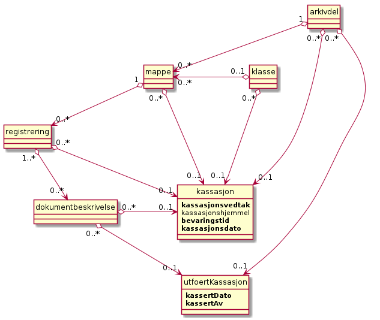

Funksjoner for periodiske oppgaver
==================================

Antall mapper med tilhørende arkivdokumenter i et arkiv vil stadig vokse. Etter som tiden går, vil eldre mapper bli mer og mer uaktuelle for arkivskaper, og det kan være behov for å fjerne dem fra det aktive arkivet.

Bevaring og kassasjon
---------------------

Kassasjon vil si at elektroniske dokumenter fjernes fra arkivstrukturen. Dersom dokumentet ikke er tilknyttet andre registreringer, innebærer en kassasjon også at dokumentet slettes helt fra Noark 5-løsningen. Kassasjon av fysiske dokumenter vil si at de plukkes ut fra stedet de oppbevares, og makuleres eller destrueres på en betryggende måte.

Riksarkivaren har myndighet til å fatte bevarings- og kassasjonsvedtak for offentlige arkiver. Det betyr at offentlige arkivskapere ikke fritt kan kassere sine dokumenter etter eget ønske. Et bevaringsvedtak innebærer at det aktuelle arkivmaterialet skal bevares for all framtid, og at det må overføres - eller *avleveres* - til et arkivdepot.

Kassasjon er like aktuelt i elektroniske arkiver som i fysiske arkiver. Langtidsoppbevaring og administrasjon (f.eks. konvertering til nye formater) av store mengder elektroniske dokumenter kan medføre minst like store omkostninger som langtidslagring av fysiske dokumenter. Men økonomi er ikke den eneste grunnen til at en fortløpende og systematisk bør kassere alle dokumenter som ikke har noen bevaringsverdi - verken for arkivskaper eller arkivmyndighetene. Informasjonstilfanget er overveldende i dagens samfunn, og jo mer unødvendig informasjon som tas vare på, jo vanskeligere kan det bli å søke fram og finne den informasjonen en virkelig trenger.

Kassasjon betyr ikke at en må gå inn og vurdere bevaringsverdien for hvert eneste dokument. For at kassasjon av elektroniske dokumenter skal være praktisk gjennomførbart, må en fastsette bevarings- og kassasjonskriterier på et overordnet plan - dvs. på et makronivå. Internasjonal arkivteori argumenterer for *funksjonsbasert makrokassasjon*. Det betyr at arkivdokumentenes bevaringsverdi avhenger av funksjonen eller aktiviteten som har skapt dokumentet - og ikke av selve innholdet i dokumentet. Også i Norge er det enighet om at funksjonsbasert kassasjon på makronivå kan være en viktig metode, selv om hensynet til dokumentenes innhold tradisjonelt er tillagt stor betydning. [13]_

Konseptuell modell for Kassasjon
~~~~~~~~~~~~~~~~~~~~~~~~~~~~~~~~~~

*Figur 6.1 Kassasjon*

Overordnede kassasjonsbestemmelser kan settes på arkiv- og klassenivå, og skal da arves nedover i arkivstrukturen til mappe, registrering og dokumentbeskrivelse. Verdiene som arves skal kunne overstyres. Ved deponering/avlevering er det bare kassasjonsvedtak som innebærer kassasjon som skal være med. Det skal altså ikke knyttes opplysninger om kassasjon til arkivenheter hvor alle tilordnede dokumenter skal bevares. Kassasjon kan altså være knyttet en gang til arkivdel, klasse, mappe, registrering og dokumentbeskrivelse.

Et *bevarings- og kassasjonsvedtak* forteller hva som skal skje med dokumentene når *bevaringstiden* er nådd. Obligatoriske verdier er "Bevares", "Kasseres" og "Vurderes senere". Bevaringstiden kan typisk være 5, 10 eller 30 år. *Kassasjonsdatoen* beregnes automatisk på grunnlag av bevaringstiden. Bevaringstiden skal begynne å løpe fra tidspunktet når en saksmappe er avsluttet, men det skal også være mulig å fastsette andre regler for beregning av kassasjonsdato.

Funksjonsbasert kassasjon forutsetter at klassifikasjonssystemet beskriver virksomhetens funksjoner og aktiviteter. I Noark 5 skal det være mulig å sette bevarings- og kassasjonsvedtak på de enkelte klassene i et klassifikasjonssystem. Dette skal da automatisk kunne arves til alle mapper som tilordnes klassen.

Det skal også være mulig å sette bevarings- og kassasjonsvedtak på en arkivdel. Det betyr da at alle mapper i arkivdelen arver det samme vedtaket. Dersom arv skjer fra arkivdelen, skal det ikke samtidig være mulig med arv fra klassene. Bevarings- og kassasjonsvedtak for en hel arkivdel er først og fremst aktuelt ved enkelte fagsystemer som produserer såkalte "enstypeserier".

Arv skal kunne skje videre ned til registrerings- og dokumentbeskrivelsesnivå. Selv om kassasjon ofte omfatter hele mapper, skal det være mulig å bevare en eller flere av registreringene i mappen, og kassere resten. [14]_

**Funksjonelle krav til bevaring og kassasjon**

.. table:: Funksjonelle krav til bevaring og kassasjon
+-------------------------------------------------+-------------------------------------------------+-------------------------------------------------+-------------------------------------------------+
| Krav nr.                                        | Funksjonelle krav til bevaring og kassasjon     | Type                                             | Merknad                                         |
+-------------------------------------------------+-------------------------------------------------+-------------------------------------------------+-------------------------------------------------+
| 1.                                              | Metadata om bevaring og kassasjon på en         | B                                               | Obligatorisk hvis kassasjon er aktuelt          |
|                                                 | *klasse* skal kunne arves til *mappe,           |                                                 |                                                 |
|                                                 | registrering og dokumentbeskrivelse*.           |                                                 |                                                 |
+-------------------------------------------------+-------------------------------------------------+-------------------------------------------------+-------------------------------------------------+
| 2.                                              | Metadata om bevaring og kassasjon på en         | B                                               | Obligatorisk hvis kassasjon er aktuelt          |
|                                                 | *arkivdel* skal kunne arves til *mappe,         |                                                 |                                                 |
|                                                 | registrering og* *dokumentbeskrivelse*.         |                                                 |                                                 |
+-------------------------------------------------+-------------------------------------------------+-------------------------------------------------+-------------------------------------------------+
| 3.                                              | Dersom arv av metadata om bevaring og kassasjon | B                                               | Obligatorisk hvis kassasjon er aktuelt          |
|                                                 | skal skje fra arkivdel, skal dette overstyre    |                                                 |                                                 |
|                                                 | arv av metadata fra klassene.                   |                                                 |                                                 |
+-------------------------------------------------+-------------------------------------------------+-------------------------------------------------+-------------------------------------------------+
| 4.                                              | Det skal finnes en tjeneste / funksjon for å    | B                                               | Obligatorisk for påføring av kassasjonsvedtak   |
|                                                 | registrere et kassasjonsvedtak for en *mappe*,  |                                                 | utover arkivdel og klasse.                      |
|                                                 | *registrering* eller *dokumentbeskrivelse*.     |                                                 |                                                 |
|                                                 |                                                 |                                                 |                                                 |
|                                                 | Kassasjonsvedtaket skal bestå av følgende       |                                                 |                                                 |
|                                                 | obligatoriske verdier:                          |                                                 |                                                 |
|                                                 |                                                 |                                                 |                                                 |
|                                                 | - Bevares                                       |                                                 |                                                 |
|                                                 | - Kasseres                                      |                                                 |                                                 |
|                                                 | - Vurderes senere                               |                                                 |                                                 |
|                                                 |                                                 |                                                 |                                                 |
|                                                 | Andre verdier kan legges til.                   |                                                 |                                                 |
+-------------------------------------------------+-------------------------------------------------+-------------------------------------------------+-------------------------------------------------+
| 5.                                              | Det skal være mulig manuelt å registrere        | B                                               | Obligatorisk hvis 6.1.4 oppfylles               |
|                                                 | kassasjonsvedtak, kassasjonshjemmel og          |                                                 |                                                 |
|                                                 | bevaringstid for en *mappe*, *registrering*     |                                                 |                                                 |
|                                                 | eller *dokumentbeskrivelse*.                    |                                                 |                                                 |
+-------------------------------------------------+-------------------------------------------------+-------------------------------------------------+-------------------------------------------------+
| 6.                                              | Bevaringsdatoen for en *mappe*, *registrering*  | B                                               | Obligatorisk hvis 6.1.4 oppfylles               |
|                                                 | eller *dokumentbeskrivelse* skal kunne beregnes |                                                 |                                                 |
|                                                 | automatisk på grunnlag av bevaringstid og       |                                                 |                                                 |
|                                                 | datoen mappen ble avsluttet.                    |                                                 |                                                 |
+-------------------------------------------------+-------------------------------------------------+-------------------------------------------------+-------------------------------------------------+
| 7.                                              | Andre regler for beregning av bevaringsdato bør | V                                               |                                                 |
|                                                 | kunne være mulig.                               |                                                 |                                                 |
+-------------------------------------------------+-------------------------------------------------+-------------------------------------------------+-------------------------------------------------+
| 8.                                              | Bevaringsdato for en *mappe, registrering*      | B                                               | Obligatorisk hvis 6.1.4 oppfylles               |
|                                                 | eller *dokumentbeskrivelse* skal også kunne     |                                                 |                                                 |
|                                                 | registreres manuelt. Bevaringstid er da ikke    |                                                 |                                                 |
|                                                 | obligatorisk.                                   |                                                 |                                                 |
+-------------------------------------------------+-------------------------------------------------+-------------------------------------------------+-------------------------------------------------+
| 9.                                              | Det skal være mulig å slå av funksjonen for arv | B                                               | Obligatorisk for funksjon for arv av            |
|                                                 | fra klasser og arkivdeler, slik at metadata om  |                                                 | kassasjonskode                                  |
|                                                 | bevaring og kassasjon ikke arves til            |                                                 |                                                 |
|                                                 | underliggende mapper.                           |                                                 |                                                 |
+-------------------------------------------------+-------------------------------------------------+-------------------------------------------------+-------------------------------------------------+
| 10.                                             | Det skal være mulig å angi at arv av metadata   | B                                               | Obligatorisk for funksjon for arv av            |
|                                                 | om bevaring og kassasjon også skal gå ned til   |                                                 | kassasjonskode                                  |
|                                                 | registrering og dokumentbeskrivelse.            |                                                 |                                                 |
+-------------------------------------------------+-------------------------------------------------+-------------------------------------------------+-------------------------------------------------+
| 11.                                             | Metadata om bevaring og kassasjon som arves fra | B                                               | Obligatorisk for funksjon for arv av            |
|                                                 | et arkivobjekt til alle underliggende           |                                                 | kassasjonskode                                  |
|                                                 | arkivobjekter, skal kunne overskrives.          |                                                 |                                                 |
+-------------------------------------------------+-------------------------------------------------+-------------------------------------------------+-------------------------------------------------+

Kassasjon av dokumenttyper
~~~~~~~~~~~~~~~~~~~~~~~~~~~~

Bevaring og kassasjon er altså i utgangpunktet knyttet til metadata som arves fra klassen, eller eventuelt arkivdelen, til alle underliggende mapper. I tillegg skal det også være mulig å foreta gjennomgående kassasjon av bestemte typer dokumenter. Derfor bør det også være mulig å knytte bevaring og kassasjon til registreringstyper, dokumenttyper eller andre egendefinerte typer. [15]_

Kassasjon av dokumenttyper kan implementeres ved at bestemte registreringstyper eller dokumenttyper automatisk knyttes til en arkivdel som inneholder bevarings- og kassasjonsvedtaket for den bestemte typen. Dette vedtaket skal da arves til registreringen eller dokumentbeskrivelsen. Men det kan også være andre måter å implementere denne funksjonaliteten uten å bruke arkivdel.

**Funksjonelle krav til bevaring og kassasjon**

.. table:: Funksjonelle krav til bevaring og kassasjon 2

+-------------------------------------------------+-------------------------------------------------+-------------------------------------------------+-------------------------------------------------+
| Krav nr.                                        | Funksjonelle krav til bevaring og kassasjon     | Type                                            | Merknad                                         |
+-------------------------------------------------+-------------------------------------------------+-------------------------------------------------+-------------------------------------------------+
| 12.                                             | Det bør finnes en tjeneste/funksjon som         | V                                               |                                                 |
|                                                 | automatisk knytter en bestemt type              |                                                 |                                                 |
|                                                 | registreringer eller dokumentbeskrivelser til   |                                                 |                                                 |
|                                                 | et bevarings- og kassasjonsvedtak.              |                                                 |                                                 |
+-------------------------------------------------+-------------------------------------------------+-------------------------------------------------+-------------------------------------------------+
| 13.                                             | Metadata om bevaring og kassasjon skal da arves | B                                               | Obligatoriske hvis 6.1.12 oppfylles             |
|                                                 | til alle opprettede registreringer eller        |                                                 |                                                 |
|                                                 | dokumentbeskrivelser av samme type.             |                                                 |                                                 |
+-------------------------------------------------+-------------------------------------------------+-------------------------------------------------+-------------------------------------------------+

Oversikt over dokumenter som skal kasseres eller vurderes på ny
~~~~~~~~~~~~~~~~~~~~~~~~~~~~~~~~~~~~~~~~~~~~~~~~~~~~~~~~~~~~~~~~~~~~

Før kassasjonen gjennomføres, skal det være mulig å få presentert en oversikt over dokumenter som skal kasseres. En slik oversikt skal inneholde de viktigste metadataene, inkludert alle metadata for bevaring og kassasjon. Fra denne oversikten skal det også være mulig å åpne selve dokumentet, slik at en kan få kontrollert dokumentinnholdet. Dersom oversikten inneholder dokumenter som ikke skal kasseres i denne omgang, skal det være mulig å endre metadata direkte fra oversikten. Oversikten skal kunne begrenses til å omfatte et utvalg dokumenter, f.eks. knyttet til en bestemt klasse.

På samme måte skal det være mulig å få presentert en oversikt over dokumenter som skal vurderes for bevaring og kassasjon på et senere tidspunkt. Dette er først og fremst aktuelt for arkiv­materiale som dokumenterer enkeltpersoners eller virksomheters rettigheter, og hvor det er usikkert om dokumentasjonsbehovet er varig eller ikke. For andre typer materiale er det ikke ønskelig at muligheten for vurdering på et senere tidspunkt brukes. Også fra denne oversikten skal det være mulig å endre metadata direkte.

En slik funksjonalitet er bare nødvendig å ha i de tilfeller en arkivdeler inneholder både informasjon som skal kasseres og informasjon som skal bevares. Det er obligatorisk for alminnelig sakarkivsystem å ha slik funksjonalitet. Det kan tenkes løsninger der det ikke vil være nødvendig med en slik avansert funksjonalitet, der det ikke vil våre nødvendig med funksjon for å åpne dokumenter fra presentasjonen av kassable dokumenter eller det å kunne lage en særskilt oversikt over kassable dokumenter.

**Funksjonelle krav til bevaring og kassasjon**

.. table:: Funksjonelle krav til bevaring og kassasjon  

+-------------------------------------------------+-------------------------------------------------+-------------------------------------------------+-------------------------------------------------+
| Krav nr.                                        | Funksjonelle krav til bevaring og kassasjon     | Type                                            | Merknad                                         |
+-------------------------------------------------+-------------------------------------------------+-------------------------------------------------+-------------------------------------------------+
| 14.                                             | Det skal være mulig å få presentert en oversikt | O                                               |                                                 |
|                                                 | over dokumenter som skal kasseres etter et      |                                                 |                                                 |
|                                                 | bestemt tidspunkt. En slik oversikt skal kunne  |                                                 |                                                 |
|                                                 | begrenses til et mindre utvalg dokumenter.      |                                                 |                                                 |
+-------------------------------------------------+-------------------------------------------------+-------------------------------------------------+-------------------------------------------------+
| 15.                                             | Det skal være mulig å få presentert en oversikt | O                                               |                                                 |
|                                                 | over dokumenter som skal vurderes på nytt for   |                                                 |                                                 |
|                                                 | bevaring eller kassasjon etter et bestemt       |                                                 |                                                 |
|                                                 | tidspunkt. En slik oversikt skal kunne          |                                                 |                                                 |
|                                                 | begrenses til et mindre utvalg dokumenter.      |                                                 |                                                 |
+-------------------------------------------------+-------------------------------------------------+-------------------------------------------------+-------------------------------------------------+
| 16.                                             | Oversikten skal inneholde de viktigste metadata | O                                               |                                                 |
|                                                 | for dokumentene, inkludert metadata for         |                                                 |                                                 |
|                                                 | bevaring og kassasjon.                          |                                                 |                                                 |
+-------------------------------------------------+-------------------------------------------------+-------------------------------------------------+-------------------------------------------------+
| 17.                                             | Det bør være mulig å åpne et dokument for       | V                                               |                                                 |
|                                                 | presentasjon av innhold direkte fra denne       |                                                 |                                                 |
|                                                 | oversikten.                                     |                                                 |                                                 |
+-------------------------------------------------+-------------------------------------------------+-------------------------------------------------+-------------------------------------------------+
| 18.                                             | Autoriserte brukere bør kunne endre metadata    | V                                               |                                                 |
|                                                 | for bevaring og kassasjon for de enkelte        |                                                 |                                                 |
|                                                 | dokumenter direkte fra oversikten.              |                                                 |                                                 |
+-------------------------------------------------+-------------------------------------------------+-------------------------------------------------+-------------------------------------------------+

Sletting av dokumenter og metadata
~~~~~~~~~~~~~~~~~~~~~~~~~~~~~~~~~~

Kriteriet for at et dokument skal kunne kasseres er at metadata for kassasjonsvedtak har verdien "Kasseres", og at dagens dato har passert bevaringsdatoen. Løsningen bør kontrollere at presedenssaker aldri tillates kassert.

Kassasjon av elektroniske dokumenter innebærer at referansen mellom metadata og dokumenter slettes, slik at dokumentene ikke lenger kan hentes fram ved hjelp av metadata. Dette skjer ved at all metadata om dokumentobjektet fjernes. Alle versjoner, varianter eller formater av dokumentet skal omfattes av kassasjonen. Dersom samme dokument (dokumentbeskrivelse) er knyttet til flere registreringer, må ikke dokumentet slettes fra filsystemet. Finnes det ingen slik tilknytning, skal også dokumentet slettes.

Kassasjon av dokumenter er altså en kritisk funksjon som mange vil kvie seg for å utføre. Det bør derfor være mulig å angre en kassasjon og gjenopprette tilknytningen til de kasserte dokumentene, jf. muligheten som operativsystemene har til å hente fram igjen dokumenter som er "kastet i papirkurven".

Selve funksjonen for å utføre kassasjon skal kunne begrenses til å omfatte utvalgte dokumenter, f.eks. alle dokumenter som tilhørere en bestemt klasse. Det skal være mulig å utføre kassasjonen som en automatisk prosess, men det skal også være mulig å be om å få spørsmål om kassasjon er aktuelt for hvert eneste dokument.

Kassasjon av dokumenter betyr ikke at metadata skal slettes. Arkivforskriften har et bevaringspåbud for "journaldatabaser". Det betyr altså at metadata om kasserte dokumenter i utgangspunktet skal bevares, og avleveres til depot. Det skal likevel være mulig å angi at kassasjon også innebærer sletting av tilhørende metadata. Dette vil da være særlig aktuelt ved bestemte typer fagsystemer eller "enstypeserier". I slike tilfeller skal verken metadata eller dokumenter bevares.

**Funksjonelle krav til bevaring og kassasjon**

.. table:: Funksjonelle krav til bevaring og kassasjon

+-------------------------------------------------+-------------------------------------------------+-------------------------------------------------+-------------------------------------------------+
| Krav nr.                                        | Funksjonelle krav til bevaring og kassasjon     | Type                                            | Merknad                                         |
+-------------------------------------------------+-------------------------------------------------+-------------------------------------------------+-------------------------------------------------+
| 19.                                             | Det skal finnes en funksjon for å kassere alle  | B                                               | Obligatorisk i løsninger hvor kassasjon skal    |
|                                                 | dokumenter som har verdien "Kasseres" som       |                                                 | skje og ved behov for skille mellom kassable og |
|                                                 | kassasjonsvedtak, og hvor bevaringsdatoen er    |                                                 | ikke kassable dokumenter.                       |
|                                                 | eldre enn dagens dato. En slik funksjon skal    |                                                 |                                                 |
|                                                 | kunne begrenses til et mindre utvalg            |                                                 |                                                 |
|                                                 | dokumenter.                                     |                                                 |                                                 |
+-------------------------------------------------+-------------------------------------------------+-------------------------------------------------+-------------------------------------------------+
| 20.                                             | Det skal ikke være mulig å sette                | O                                               |                                                 |
|                                                 | kassasjonsvedtak "Kasseres" på en mappe som er  |                                                 |                                                 |
|                                                 | registrert som presedenssak.                    |                                                 |                                                 |
+-------------------------------------------------+-------------------------------------------------+-------------------------------------------------+-------------------------------------------------+
| 21.                                             | Kassasjonen skal kunne utføres automatisk for   | B                                               | Obligatorisk når 6.1.19 oppfylles               |
|                                                 | hele utvalget dokumenter, men det skal også     |                                                 |                                                 |
|                                                 | være mulig å be om spørsmål om kassasjon skal   |                                                 |                                                 |
|                                                 | utføres for hvert enkelt dokument.              |                                                 |                                                 |
+-------------------------------------------------+-------------------------------------------------+-------------------------------------------------+-------------------------------------------------+
| 22.                                             | Bare autoriserte brukere kan starte en funksjon | O                                               |                                                 |
|                                                 | for kassasjon av dokumenter.                    |                                                 |                                                 |
+-------------------------------------------------+-------------------------------------------------+-------------------------------------------------+-------------------------------------------------+
| 23.                                             | Alle versjoner, varianter og formater av        | O                                               |                                                 |
|                                                 | dokumentet skal omfattes av kassasjonen.        |                                                 |                                                 |
+-------------------------------------------------+-------------------------------------------------+-------------------------------------------------+-------------------------------------------------+
| 24.                                             | Kassasjon skal innebære at all metadata om      | O                                               |                                                 |
|                                                 | dokumentobjektet slettes. Selve dokumentet skal |                                                 |                                                 |
|                                                 | slettes fra filsystemet dersom dokumentet       |                                                 |                                                 |
|                                                 | (dokumentbeskrivelsen) ikke er knyttet til      |                                                 |                                                 |
|                                                 | andre registreringer.                           |                                                 |                                                 |
+-------------------------------------------------+-------------------------------------------------+-------------------------------------------------+-------------------------------------------------+
| 25.                                             | Funksjonen for kassasjon bør være i to trinn,   | V                                               |                                                 |
|                                                 | slik at det i første omgang er mulig å          |                                                 |                                                 |
|                                                 | gjenopprette de kasserte dokumentene. Endelig   |                                                 |                                                 |
|                                                 | sletting av dokumentobjekt og dokument skal     |                                                 |                                                 |
|                                                 | kunne skje på et senere tidspunkt.              |                                                 |                                                 |
+-------------------------------------------------+-------------------------------------------------+-------------------------------------------------+-------------------------------------------------+
| 26.                                             | Metadata om dokumentet ned til                  | O                                               |                                                 |
|                                                 | dokumentbeskrivelse, skal i utgangspunktet ikke |                                                 |                                                 |
|                                                 | slettes selv om dokumentet kasseres.            |                                                 |                                                 |
+-------------------------------------------------+-------------------------------------------------+-------------------------------------------------+-------------------------------------------------+
| 27.                                             | For hvert dokument som blir kassert, skal det   | O                                               |                                                 |
|                                                 | på dokumentbeskrivelsesnivå logges dato for     |                                                 |                                                 |
|                                                 | kassasjon og hvem som utførte kassasjonen.      |                                                 |                                                 |
+-------------------------------------------------+-------------------------------------------------+-------------------------------------------------+-------------------------------------------------+

Kassasjonsliste
~~~~~~~~~~~~~~~

Hensikten med rapporten *Kassasjonsliste* er todelt, både å være en hjelp i selve kassasjonsarbeidet og å gi en oversikt over hvilke saker som er kassert.

**Krav til rapporten Kassasjonsliste**

.. table:: Krav til rapporten Kassasjonsliste

+----------+--------------------------------------------------------------------------------------------+------+-------------------------------------------------------------------+
| Krav nr. | Krav til rapporten *Kassasjonsliste*                                                       | Type | Merknad                                                           |
+----------+--------------------------------------------------------------------------------------------+------+-------------------------------------------------------------------+
| 28.      | *Selektering:*                                                                             | B    | Obligatorisk for løsninger som skal legge til rette for kassasjon |
|          |                                                                                            |      |                                                                   |
|          | Rapporten skal kunne selekteres på følgende metadataelementer i *Saksmappe*:               |      |                                                                   |
|          |                                                                                            |      |                                                                   |
|          | - *kassasjonsdato* (intervall skal kunne angis)                                            |      |                                                                   |
|          | - *kassasjonsvedtak*                                                                       |      |                                                                   |
|          | - *administrativEnhet* (Her skal det kunne angis om underliggende enheter skal inkluderes) |      |                                                                   |
|          |                                                                                            |      |                                                                   |
|          | - *journalenhet*.                                                                          |      |                                                                   |
|          | - *referanseArkivdel*                                                                      |      |                                                                   |
|          | - *arkivperiodeStartDato* og *arkivperiodeSluttDato* fra arkivdel                          |      |                                                                   |
+----------+--------------------------------------------------------------------------------------------+------+-------------------------------------------------------------------+
| 29.      | Rapporten skal inneholde følgende opplysninger, så fremt de finnes i løsningen:            | B    | Obligatorisk for løsninger som skal legge til rette for kassasjon |
|          |                                                                                            |      |                                                                   |
|          | **Saksmappeinformasjon**                                                                   |      |                                                                   |
|          |                                                                                            |      |                                                                   |
|          | Fra *Saksmappe:*                                                                           |      |                                                                   |
|          |                                                                                            |      |                                                                   |
|          | *mappeID*                                                                                  |      |                                                                   |
|          |                                                                                            |      |                                                                   |
|          | *tittel*                                                                                   |      |                                                                   |
|          |                                                                                            |      |                                                                   |
|          | *opprettetDato*                                                                            |      |                                                                   |
|          |                                                                                            |      |                                                                   |
|          | *kassasjonsvedtak*                                                                         |      |                                                                   |
|          |                                                                                            |      |                                                                   |
|          | *kassasjonsdato*                                                                           |      |                                                                   |
|          |                                                                                            |      |                                                                   |
|          | *administrativEnhet*                                                                       |      |                                                                   |
|          |                                                                                            |      |                                                                   |
|          | *referanseArkivdel*                                                                        |      |                                                                   |
|          |                                                                                            |      |                                                                   |
|          | Fra *klasse*                                                                               |      |                                                                   |
|          |                                                                                            |      |                                                                   |
|          | *klasseID og tittel*                                                                       |      |                                                                   |
|          |                                                                                            |      |                                                                   |
|          | Fra *arkivdel:*                                                                            |      |                                                                   |
|          |                                                                                            |      |                                                                   |
|          | *referanseForelder*                                                                        |      |                                                                   |
|          |                                                                                            |      |                                                                   |
|          | *arkivperiodeStartDato*                                                                    |      |                                                                   |
|          |                                                                                            |      |                                                                   |
|          | *arkivperiodeSluttDato*                                                                    |      |                                                                   |
+----------+--------------------------------------------------------------------------------------------+------+-------------------------------------------------------------------+

Periodisering (kontrollert tidsskille)
--------------------------------------

Ved fysisk arkivering har det ofte vært ønskelig å skille ut det eldste og mest uaktuelle materialet fra det som er i aktivt bruk. Dette ble gjerne plassert et sted hvor kostnadene for lagring var lavere enn der det aktive arkivet ble oppbevart. Det tradisjonelle begrepet for dette er *bortsetting.* Arkiver som er bortsatt, befinner seg fremdeles hos arkivskaper. Slike arkiver er i et mellomstadium, organet har fremdeles et behov for å hente fram dokumenter fra bortsettingsarkivet - men dette behovet vil ikke forekomme så ofte.

Det anbefales at bortsetting knyttes til faste, tidsavgrensede perioder kalt *arkivperioder*. En arkivperiode kan typisk være på 5 år, men både kortere og lengre perioder er fullt mulig. Ved fysisk arkivering innebærer *periodisering* både at dokumenter flyttes fra et oppbevaringssted til et annet, og at denne flyttingen fremgår av arkivstrukturen og metadataene som er knyttet til dokumentene.

Periodisering vil i mange tilfelle også være hensiktsmessig i et elektronisk arkiv. Her er det ikke hensynet til fysisk oppbevaringsplass som er det avgjørende, men behovet for oversikt og rask gjenfinning ved søk. Etter hvert som antall mapper vokser, vil det bli stadig mer upraktisk å ha eldre avsluttede mapper liggende sammen med de som ennå er åpne eller nettopp avsluttet. Derfor kan vi også ved elektronisk arkivering med fordel organisere arkivet i en *aktiv* periode, og en eller flere *avsluttede* perioder. Denne oppdelingen omfatter da altså både de elektroniske dokumentene og tilhørende metadata.

Prinsippene for periodisering som ble introdusert i Noark-4 videreføres i Noark 5. Her skilles det mellom to hovedtyper periodisering: skarpt periodeskille og skille ved overlappingsperiode.

*Skarpt periodeskille* vil si at alle åpne mapper (pågående saker) i en avsluttet periode må lukkes, og så opprettes på nytt i en ny periode (arvtakeren) ved neste registrering. Dette betyr altså at dokumenter som hører sammen vil befinne seg i to forskjellige mapper, og disse vil tilhøre hver sin periode. Disse mappene må derfor bindes sammen med en referanse. Skarpt periodeskille anbefales ikke ved elektronisk arkiv.

Periodisering med *overlappingsperiode* (også kalt "mykt" periodeskille) innebærer at dersom en mappe ikke er avsluttet ved periodens slutt, skal hele mappen - med alle tidligere registreringer - flyttes over til en ny, aktiv periode ved neste registrering. Denne overflyttingen skal skje automatisk så lenge overlappingsperioden varer. Ved overlappingsperiodens slutt vil de fleste aktive saker være overført til ny periode.

Ved periodisering spiller *arkivdel* en sentral rolle. Arkivdelene representerer forskjellige perioder, og det er mappenes tilhørighet til arkivdel som avgjør hvilken periode de befinner seg i. En arkivperiode kan være representert ved flere arkivdeler, som da dekker samme periode eller tidsrom. Arkivdelens *arkivstatus* gir informasjon om det dreier seg om en aktiv periode, overlappingsperiode eller avsluttet periode. Arkivdelene må dessuten ha en referanse seg imellom, slik at en kan knytte sammen forløper og arvtaker.

Dokumenter som skal periodiseres etter forskjellige prinsipper - f.eks. funksjonsordnede saksmapper som periodiseres ved overlappingsperiode og personalmapper som fortløpende periodiseres når de er uaktuelle - må tilhøre hver sin arkivdel. Flere arkivdeler kan altså være aktive på én gang, og de uaktuelle periodene kan utgjøre flere "generasjoner" med arkivperioder.

**Strukturelle krav til periodisering**

.. table:: Strukturelle krav til periodisering   

+----------+-------------------------------------------------------------------------------------------------------------+------+---------+
| Krav nr. | Strukturelle krav til periodisering                                                                         | Type | Merknad |
+----------+-------------------------------------------------------------------------------------------------------------+------+---------+
| 1.       | En arkivdel skal kunne inneholde en tekstlig beskrivelse av hvilke prinsipper den skal periodiseres etter.  | O    |         |
+----------+-------------------------------------------------------------------------------------------------------------+------+---------+
| 2.       | En arkivdel skal inneholde referanser til eventuelle forløpere og arvtakere. (forgjengere og etterkommere?) | O    |         |
+----------+-------------------------------------------------------------------------------------------------------------+------+---------+

En arkivdel som inneholder en *aktiv periode*, er åpen for all registrering. Nye mapper skal kunne knyttes til arkivdelen etter hvert som de opprettes.

En arkivdel som inneholder en *avsluttet periode*, er stengt for nye mapper, og mappene som allerede finnes skal være avsluttet. En avsluttet arkivdel er altså "frosset" for all ny tilvekst av mapper og dokumenter, og stort sett også for endring av metadata.

En arkivdel som inneholder en *overlappingsperiode* står i en mellomstilling. Nye mapper kan ikke tilknyttes, men eksisterende mapper kan fremdeles være åpne. Det tillates at det legges en ny registrering til en mappe i overlappingsperioden. Men løsningen skal da *automatisk* overføre hele denne mappen til arkivdelen som er arvtaker. Det betyr altså at hele mappen med alle registreringer og tilknyttede dokumenter skifter tilhørighet fra en arkivdel til en annen automatisk. Før statusen til overlappingsperioden settes til avsluttet, må det kontrolleres at det ikke finnes flere åpne mapper igjen. Dersom det er tilfelle, må mappene enten avsluttes eller overføres manuelt til arvtakeren. Det skal være mulig å overføre alle åpne mapper i en samlet, automatisert prosess.

Selv om det ikke er tillatt å knytte nye mapper til en avsluttet arkivdel, skal det være mulig å flytte avsluttede mapper til en slik arkivdel. Dersom det ikke benyttes overlappingsperiode, f.eks. i forbindelse med periodisering av personmapper, kan det være aktuelt å opprette en tom arkivdel med status som en avsluttet periode. Personmappene kan da flyttes hit fortløpende etter hvert som de blir uaktuelle.

Flytting av mapper til en avsluttet arkivdel kan skje manuelt, dvs. at en endrer tilknytningen til arkivdel for hver enkelt mappe. Men det bør også finnes en funksjon for å flytte en gruppe med mapper til en avsluttet arkivdel under ett. Dette kan f.eks. utføres for alle mapper som er søkt fram etter bestemte kriterier.

Bruk av periodisering og særlig med overlappingsperiode er ikke aktuelt for alle typer løsninger. For alminnelige sakarkivsystemer er det derimot obligatorisk å ha slik funksjonalitet. For noen vil det kun være aktuelt med skarpe periodeskiller. I slike tilfeller faller alle krav til overlappingsperiode bort.

**Funksjonelle krav til periodisering**

.. table:: Funksjonelle krav til periodisering

+-------------------------------------------------+-------------------------------------------------+-------------------------------------------------+-------------------------------------------------+
| Krav nr.                                        | Funksjonelle krav til periodisering             | Type                                            | Merknad                                         |
+-------------------------------------------------+-------------------------------------------------+-------------------------------------------------+-------------------------------------------------+
| 3.                                              | Det skal være mulig å knytte nyopprettede       | O                                               |                                                 |
|                                                 | mapper til en arkivdel som inneholder en aktiv  |                                                 |                                                 |
|                                                 | arkivperiode.                                   |                                                 |                                                 |
+-------------------------------------------------+-------------------------------------------------+-------------------------------------------------+-------------------------------------------------+
| 4.                                              | En arkivdel som inneholder en                   | O                                               |                                                 |
|                                                 | overlappingsperiode, skal være sperret for      |                                                 |                                                 |
|                                                 | tilføyelse av nyopprettede mapper. Men          |                                                 |                                                 |
|                                                 | eksisterende mapper i en overlappingsperiode    |                                                 |                                                 |
|                                                 | skal være åpne for nye registreringer.          |                                                 |                                                 |
+-------------------------------------------------+-------------------------------------------------+-------------------------------------------------+-------------------------------------------------+
| 5.                                              | Dersom en ny registrering føyes til en mappe    | O                                               |                                                 |
|                                                 | som tilhører en arkivdel i overlappingsperiode, |                                                 |                                                 |
|                                                 | skal mappen automatisk overføres til            |                                                 |                                                 |
|                                                 | arkivdelens arvtaker.                           |                                                 |                                                 |
+-------------------------------------------------+-------------------------------------------------+-------------------------------------------------+-------------------------------------------------+
| 6.                                              | En arkivdel som inneholder en avsluttet         | O                                               |                                                 |
|                                                 | arkivperiode, skal være sperret for tilføyelse  |                                                 |                                                 |
|                                                 | av nye mapper. Alle mapper skal være lukket,    |                                                 |                                                 |
|                                                 | slik at heller ingen registreringer og          |                                                 |                                                 |
|                                                 | dokumenter kan føyes til.                       |                                                 |                                                 |
+-------------------------------------------------+-------------------------------------------------+-------------------------------------------------+-------------------------------------------------+
| 7.                                              | Det skal være umulig å avslutte en arkivdel i   | O                                               |                                                 |
|                                                 | overlappingsperiode dersom den fremdeles        |                                                 |                                                 |
|                                                 | inneholder åpne mapper.                         |                                                 |                                                 |
+-------------------------------------------------+-------------------------------------------------+-------------------------------------------------+-------------------------------------------------+
| 8.                                              | Det skal være mulig å få en oversikt over       | O                                               |                                                 |
|                                                 | mapper som fremdeles er åpne i en               |                                                 |                                                 |
|                                                 | overlappingsperiode.                            |                                                 |                                                 |
+-------------------------------------------------+-------------------------------------------------+-------------------------------------------------+-------------------------------------------------+
| 9.                                              | Det skal være mulig å overføre åpne mapper fra  | O                                               |                                                 |
|                                                 | en arkivdel i en overlappingsperiode til        |                                                 |                                                 |
|                                                 | arkivdelens arvtaker.                           |                                                 |                                                 |
+-------------------------------------------------+-------------------------------------------------+-------------------------------------------------+-------------------------------------------------+
| 10.                                             | Det bør være mulig å overføre åpne mapper fra   | V                                               |                                                 |
|                                                 | en arkivdel i en samlet, automatisert prosess.  |                                                 |                                                 |
+-------------------------------------------------+-------------------------------------------------+-------------------------------------------------+-------------------------------------------------+
| 11.                                             | Det skal være mulig å flytte avsluttede mapper  | B                                               | Obligatorisk for funksjon for periodisering     |
|                                                 | til en arkivdel som inneholder en avsluttet     |                                                 |                                                 |
|                                                 | periode.                                        |                                                 |                                                 |
+-------------------------------------------------+-------------------------------------------------+-------------------------------------------------+-------------------------------------------------+
| 12.                                             | Dersom dokumentene i en arkivdel er             | O                                               |                                                 |
|                                                 | ikke-elektroniske (fysiske), skal det også være |                                                 |                                                 |
|                                                 | mulig å registrere oppbevaringssted.            |                                                 |                                                 |
+-------------------------------------------------+-------------------------------------------------+-------------------------------------------------+-------------------------------------------------+

Migrering mellom Noark-løsninger
---------------------------------

Med *migrering* menes i denne sammenheng flytting av komplette datasett fra en teknisk plattform til en annen (ny versjon eller ny løsning), hvor dataene i så stor grad som mulig skal være uendret etter at dataene er flyttet.

Informasjonen som er lagret i en Noark 5-løsning skal kunne eksporteres - eller trekkes ut - til et systemuavhengig format. Eksporten skal omfatte både arkivstrukturen, metadata og eventuelt tilknyttede elektroniske dokumenter. Det skilles mellom to varianter av eksport - migreringsuttrekk og arkivuttrekk.

Migreringsuttrekk skal kunne brukes for migrering av data ved oppgradering til ny versjon av samme løsning, eller ved overgang til en annen Noark-løsning. Det bør også være mulig å overføre aktive arkivdeler fra ett system til et annet, f.eks. i forbindelse med organisasjonsendringer. Dette betyr at en Noark-løsning også må kunne importere data fra et migreringsuttrekk.

Migrering av data innebærer at en Noark-løsning både må kunne håndtere eksport og import. En slik migrering kan være aktuell ved oppgradering til ny versjon. En bruker som går over til en ny Noark-løsning fra en annen leverandør, skal kunne overføre sine gamle data til den nye løsningen uten at det oppstår noen problemer. Det bør også være mulig å importere deler av data fra en løsning inn i en annen løsning som allerede er i bruk. Dette kan være aktuelt ved omorganiseringer hvor for eksempel deler av et organs ansvarsområde overføres til et annet organ.

Dersom en eller flere arkivdeler flyttes fra en løsning til en annen vil det være behov for en avtale som regulerer det faktiske innholdet i migreringsuttrekket. Dette med bakgrunn i eventuelle forskjeller mellom løsningene.

**Krav til migrering mellom Noark-løsninger**

.. table:: Krav til migrering mellom Noark-løsninger

+-------------------------------------------------+-------------------------------------------------+-------------------------------------------------+-------------------------------------------------+
| Krav nr:                                        | Krav til migrering mellom Noark-løsninger       | Type                                            | Merknad                                         |
+-------------------------------------------------+-------------------------------------------------+-------------------------------------------------+-------------------------------------------------+
| 1.                                              | Det skal være mulig å eksportere alle metadata  | O                                               |                                                 |
|                                                 | som er definert i denne standarden med          |                                                 |                                                 |
|                                                 | tilhørende dokumenter basert på                 |                                                 |                                                 |
|                                                 | avleveringsformatet.                            |                                                 |                                                 |
+-------------------------------------------------+-------------------------------------------------+-------------------------------------------------+-------------------------------------------------+
| 2.                                              | Det bør være mulig å importere alle metadata    | V                                               |                                                 |
|                                                 | som er definert i denne standarden med          |                                                 |                                                 |
|                                                 | tilhørende dokumenter basert på                 |                                                 |                                                 |
|                                                 | avleveringsformatet.                            |                                                 |                                                 |
+-------------------------------------------------+-------------------------------------------------+-------------------------------------------------+-------------------------------------------------+
| 3.                                              | Det bør være mulig å eksportere deler av        | V                                               |                                                 |
|                                                 | arkivstrukturen, f.eks. en arkivdel eller en    |                                                 |                                                 |
|                                                 | klasse.                                         |                                                 |                                                 |
+-------------------------------------------------+-------------------------------------------------+-------------------------------------------------+-------------------------------------------------+
| 4.                                              | Det bør være mulig å importere deler av         | V                                               |                                                 |
|                                                 | arkivstrukturen, f.eks. en arkivdel eller en    |                                                 |                                                 |
|                                                 | klasse.                                         |                                                 |                                                 |
+-------------------------------------------------+-------------------------------------------------+-------------------------------------------------+-------------------------------------------------+
| 5.                                              | Det skal produseres en logg over alle           | B                                               | Obligatorisk ved import                         |
|                                                 | metadataelementer og dokumenter som ikke kan    |                                                 |                                                 |
|                                                 | importeres og over andre feil som eventuelt     |                                                 |                                                 |
|                                                 | oppstår under importen.                         |                                                 |                                                 |
+-------------------------------------------------+-------------------------------------------------+-------------------------------------------------+-------------------------------------------------+
| 6.                                              | Når det foretas en import skal det genereres en | B                                               | Obligatorisk ved import                         |
|                                                 | loggfil med informasjon om hvordan importen har |                                                 |                                                 |
|                                                 | gått, f.eks. antall metadataelementer og        |                                                 |                                                 |
|                                                 | dokumenter. Loggfilen skal også inneholde en    |                                                 |                                                 |
|                                                 | liste over alle metadataelementer og dokumenter |                                                 |                                                 |
|                                                 | som det ikke har vært mulig å importere.        |                                                 |                                                 |
+-------------------------------------------------+-------------------------------------------------+-------------------------------------------------+-------------------------------------------------+

Avlevering
-----------

En *avlevering* vil si at arkivmateriale overføres fra arkivskaper til arkivdepot. Offentlige organer skal avlevere arkivmateriale som det er fattet bevaringsvedtak for. Hovedregelen er at arkivmaterialet skal avleveres 25 år etter at det er produsert, fordi en da regner med at det har gått ut av administrativt bruk. En avlevering innebærer at råderetten for materialet overføres fra arkivskaper til arkivdepot. Etter avlevering er det arkivdepotet som må vedlikeholde og tilgjengeliggjøre materialet.

Når papirarkiver avleveres flyttes arkivmaterialet fra arkivskapers lokaler til arkivdepot. Elektronisk arkivmateriale leveres som et *arkivuttrekk* som består av dokumentfiler med tilhørende metadata. Arkivskaper har ansvaret for å produsere arkivuttrekket og sende en kopi til arkivdepotet. I tillegg til arkivuttrekket skal det også følge med en overordnet dokumentasjon av uttrekket som følger Riksarkivarens ADDML-standard. Til sammen utgjør dette en arkivversjon. En nærmere beskrivelse av innholdet i en arkivversjon følger nedenfor.

I de fleste tilfeller vil elektronisk arkivmateriale først bli overført som *deponering*, og senere skifte status til avlevering når det er 25 år gammelt. Ordningen med deponering forut for avlevering er etablert for å sikre at arkivuttrekk blir fremstilt mens løsningene fortsatt er i operativ drift. Slike tidlige overføringer av materiale formaliseres ikke som avleveringer fordi arkivskaperen fortsatt må ha ansvaret for å betjene seg selv og egne brukere. Arkivdepotet kan normalt ikke overta ansvaret for betjeningen av aktive løsninger. Arkivskaper kan altså ikke slette materiale det er foretatt deponering fra før det har fått status som avlevert.

Statusskiftet fra deponering til avlevering vil normalt skje når den yngste delen av materialet er 25 år gammelt. Dersom arkivuttrekket består av årgangsfiler, kan dette skiftet skje suksessivt for hver enkelt årgang ved 25 års alder når forholdene ligger praktisk til rette for dette.

Ved overgangen fra deponering til avlevering kan det være tale om å fremstille og overføre en ny arkivversjon. Dette vil være aktuelt dersom informasjonen i produksjonssystemet er blitt korrigert etter deponeringen, for eksempel ved at kassasjoner er gjennomført eller at det er foretatt endringer i skjermingen av metadata eller dokumenter. Fremstillingen av et arkivuttrekk forutsettes imidlertid å være organisert slik at det bare omfatter avsluttede deler eller perioder fra vedkommende løsning.

I dette kapitlet vil det ikke bli skilt mellom deponering og avlevering. Når vi her snakker om begrepet avlevering, vil det omfatte både deponering og avlevering.

Overordnede krav: Riksarkivarens bestemmelser og OAIS
~~~~~~~~~~~~~~~~~~~~~~~~~~~~~~~~~~~~~~~~~~~~~~~~~~~~~

*Forskrift til arkivloven av 17. desember 2017 om utfyllende tekniske og arkivfaglige bestemmelser om behandling av offentlige arkiver (riksarkivarens forskrift), kapittel 5* inneholder overordnede krav til elektronisk arkivmateriale som skal avleveres eller overføres som depositum til Arkivverket.

En deponering/avlevering fra Noark 5 skal bestå av arkivdokumenter, journalrapporter, metadata til arkivdokumentene og endringslogg. Dette er altså data som eksporteres fra produksjonssystemet, og samlebetegnelsen på dette er et *arkivuttrekk*. I tillegg skal avleveringen inneholde dokumentasjon av selve arkivuttrekket. Denne dokumentasjonen utgjøres av en fil som heter **arkivuttrekk.xml**, samt av XML-skjemaer til alle XML-filene i uttrekket. Riksarkivarens bestemmelser bruker begrepet *arkivversjon* for en samlet leveranse som består både av arkivuttrekk og dokumentasjon.

Arkivdokumentene skal avleveres i gyldige *arkivformater*. Dette er formater som er fastsatt i § 5-17 i riksarkivarens forskrift.

Resten av innholdet i arkivversjonen utgjøres av strukturert informasjon, og skal avleveres i XML-format.

I tilegg til selve avleveringspakken skal det også separat overføres en fil kalt **info.xml,** som inneholder overordnet informasjon om deponeringen eller avleveringen, jf. § 5-31 i riksarkivarens forskrift.

ISO 14721 OAIS (Open Archival Information System) er en internasjonal standard for langtidslagring av digitale objekter. OAIS er ingen implementeringsmodell, men en referanse- og begrepsmodell. Standarden beskriver hvilke funksjoner som må finnes i et elektronisk arkiv, og hvordan en skal organisere informasjon som avleveres, langtidslagres og tilgjengeliggjøres for publikum. Sentralt i OAIS er at alle objekter som skal bevares, må utgjøre selvstendige og selvforklarende enheter. Disse enhetene kalles *informasjonspakker* (Information Packages). Et arkivuttrekk skal inngå i en hovedtype av slike pakker, nemlig en avleveringspakke eller SIP (Submission Information Package). OAIS definerer også andre typer pakker. For arkivering i depot beskrives en AIP (Archival Information Package) og for tilgjengeliggjøring defineres en DIP (Disseminatin Information Package). Merk altså at en arkivversjon slik dette begrepet brukes i Riksarkivarens bestemmelser, tilsvarer OAIS-standardens avleveringspakke (SIP). I resten av dette kapitlet vil derfor begrepet *avleveringspakke* bli brukt.

En avleveringspakke består av to hovedtyper informasjon, *innholdsinformasjon* (Content Information) og *bevaringsbeskrivende informasjon* (Preservation Description Information). Innholdsinformasjonen i en Noark 5 avleveringspakke er arkivdokumenter og journalrapporter. Det er dokumentene og journalene - og det budskapet innholdet i disse formidler - som er gjenstand for bevaring.

Den bevaringsbeskrivende informasjonen utgjøres av de metadataene og loggene som er beskrevet i Noark 5. En viktig oppgave for den bevaringsbeskrivende informasjonen er å opprettholde integriteten og autentisiteten til selve innholdet. I tillegg trengs det også en del av den bevaringsbeskrivende informasjonen består av en tredje type informasjon, nemlig *representasjonsinformasjon* (Representation Information). Dette kalles også for tekniske metadata, og er nødvendig for at vi skal kunne tolke, forstå og bruke elektronisk informasjon. I en Noark 5 avleveringspakke tilhører XML-skjemaene denne typen.

OAIS grupperer den bevaringsbeskrivende informasjonen - dvs. metadataene - i fem typer:

1. *Referanseinformasjon* (Reference Information). Alle dokumenter i avleveringspakkenen må ha en entydig identifikasjon. Grupper av metadata (arkivenheter) må også kunne identifiseres entydig gjennom sin systemID.

2. *Proveniensinformasjon* (Provenance Information). Dokumentasjon av arkivdokumentenes opprinnelse, f.eks. hvem som er arkivskaper.

3. *Kontekstinformasjon* (Context Information). De fleste metadataene i avleveringspakkeen dokumenterer omgivelsene rundt arkivdokumentene. Dokumentene må knyttes til de aktiviteter og prosesser som har skapt dem. Det må informeres om *når* dokumentene ble skapt, *hvem* som skapte dem og *hva* de inneholder. Og ikke minst er det viktig å knytte dokumentene til andre dokumenter de hører sammen med, f.eks. hvilke dokumenter som inngår i en felles mappe eller hvilke dokumenter som har oppstått ved utførelsen av samme type aktivitet.

4. *Integritets- og autentisitetsbevarende informasjon* (Fixity Information). Både dokumenter og filer med metadata må påføres en sjekksum som gir garanti for at integriteten og autentisiteten opprettholdes, dvs. at dokumentene er det de utgir seg for å være, og at innholdet i dokumenter og metadata ikke blir endret etter at de er overført til arkivdepotet.

5. *Tilgangsinformasjon* (Access Rights Information). Enkelte dokumenter skal være unntatt offentlighet eller klausulert for innsyn av andre grunner, også etter at de er overført til depotet.

**Overordnede krav til arkivuttrekk**

.. table:: Overordnede krav til arkivuttrekk

+-------------------------------------------------+-------------------------------------------------+-------------------------------------------------+-------------------------------------------------+
| Krav nr.                                        | Overordnede krav til arkivuttrekk               | Type                                            | Merknad                                         |
+-------------------------------------------------+-------------------------------------------------+-------------------------------------------------+-------------------------------------------------+
| 1.                                              | Det skal være mulig å produsere arkivuttrekk    | B                                               | Obligatorisk ved avlevering til arkivdepot      |
|                                                 | bestående av arkivdokumenter, journalrapporter, |                                                 |                                                 |
|                                                 | metadata, endringslogg og XML-skjemaer.         |                                                 |                                                 |
+-------------------------------------------------+-------------------------------------------------+-------------------------------------------------+-------------------------------------------------+
| 2.                                              | Arkivuttrekket skal utgjøre en avleveringspakke | B                                               | Obligatorisk ved avlevering til arkivdepot      |
|                                                 | (Submission Information Packages), slik dette   |                                                 |                                                 |
|                                                 | er definert i ISO 14571 OAIS.                   |                                                 |                                                 |
+-------------------------------------------------+-------------------------------------------------+-------------------------------------------------+-------------------------------------------------+
| 3.                                              | Formatet på metadata, endringslogg og           | B                                               | Obligatorisk ved avlevering til arkivdepot      |
|                                                 | journalrapporter i arkivuttrekket skal være XML |                                                 |                                                 |
|                                                 | (XML 1.0).                                      |                                                 |                                                 |
+-------------------------------------------------+-------------------------------------------------+-------------------------------------------------+-------------------------------------------------+
| 4.                                              | Tegnsettet til alle XML-filer skal være UTF-8.  | B                                               | Obligatorisk ved avlevering til arkivdepot      |
+-------------------------------------------------+-------------------------------------------------+-------------------------------------------------+-------------------------------------------------+
| 5.                                              | Metadataelementer som ikke har verdi, skal      | B                                               | Obligatorisk ved avlevering til arkivdepot      |
|                                                 | utelates fra arkivuttrekket. I uttrekket skal   |                                                 |                                                 |
|                                                 | det med andre ord ikke forekomme tomme          |                                                 |                                                 |
|                                                 | elementer med kun start- og slutt-tagg.         |                                                 |                                                 |
+-------------------------------------------------+-------------------------------------------------+-------------------------------------------------+-------------------------------------------------+
| 6.                                              | Alfanumeriske verdier i arkivuttrekket skal     | B                                               | Obligatorisk ved avlevering til arkivdepot      |
|                                                 | representeres vha. XML Schema 1.0 -datatypen    |                                                 |                                                 |
|                                                 | string.                                         |                                                 |                                                 |
+-------------------------------------------------+-------------------------------------------------+-------------------------------------------------+-------------------------------------------------+
| 7.                                              | Datoer uten klokkeslett i arkivuttrekket skal   | B                                               | Obligatorisk ved avlevering til arkivdepot      |
|                                                 | representeres vha. XML Schema 1.0 -datatypen    |                                                 |                                                 |
|                                                 | date.                                           |                                                 |                                                 |
+-------------------------------------------------+-------------------------------------------------+-------------------------------------------------+-------------------------------------------------+
| 8.                                              | Datoer med klokkeslett i arkivuttrekket skal    | B                                               | Obligatorisk ved avlevering til arkivdepot      |
|                                                 | representeres vha. XML Schema 1.0 -datatypen    |                                                 |                                                 |
|                                                 | dateTime.                                       |                                                 |                                                 |
+-------------------------------------------------+-------------------------------------------------+-------------------------------------------------+-------------------------------------------------+
| 9.                                              | Heltall i arkivuttrekket skal representeres     | B                                               | Obligatorisk ved avlevering til arkivdepot      |
|                                                 | vha. XML Schema 1.0-datatypen integer.          |                                                 |                                                 |
+-------------------------------------------------+-------------------------------------------------+-------------------------------------------------+-------------------------------------------------+
| 10.                                             | Format på arkivdokumenter i arkivuttrekket skal | B                                               | Obligatorisk ved avlevering til arkivdepot      |
|                                                 | være et av arkivformatene definert i § 5-17 i   |                                                 |                                                 |
|                                                 | *riksarkivarens forskrift.*                     |                                                 |                                                 |
+-------------------------------------------------+-------------------------------------------------+-------------------------------------------------+-------------------------------------------------+
| 11.                                             | Organiseringen av filene i arkivuttrekket skal  | B                                               | Obligatorisk ved avlevering til arkivdepot      |
|                                                 | følge *riksarkivarens forskrift kapittel 5,* så |                                                 |                                                 |
|                                                 | langt disse er relevante.                       |                                                 |                                                 |
+-------------------------------------------------+-------------------------------------------------+-------------------------------------------------+-------------------------------------------------+

Noark 5 avleveringspakke
~~~~~~~~~~~~~~~~~~~~~~~~

Alle arkivuttrekk skal overføres til depot som del av en arkivversjon eller avleveringspakke. En avleveringspakke er en selvdokumenterende enhet, som inneholder arkivdokumenter, journalrapporter, metadata og endringslogg for en avgrenset tidsperiode. Dersom det kun er fysiske arkivdokumenter som skal avleveres, vil ikke avleveringspakken inneholde arkivdokumenter. Ved avlevering fra fagsystemer som ikke inneholder korrespondansedokumenter, vil ikke journalrapporter inngå i pakken.

En enkelt avlevering skal omfatte innholdet i en *arkivperiode*, og kan bestå av en eller flere avsluttede arkivdeler. (En periode bestående av både emneordnet og objektordnet arkivmateriale, vil typisk utgjøre to arkivdeler.) Det er bare mapper som er blitt avsluttet i løpet av perioden som skal avleveres, sammen med alle tilhørende registreringer og arkivdokumenter.

Innholdet i endringsloggen skal bare referere til metadata og arkivdokumenter i den pakken hvor loggen inngår. Journalrapportene skal dekke samme tidsrom som resten av innholdet i avleveringspakken.

Fra enkelte fagsystemer kan det være aktuelt å produsere uttrekk basert på en startdato og en sluttdato, uten hensyn til om mappene er avsluttet eller hvilken arkivdel mappene tilhører. Aktuelt seleksjonskriterium kan da f.eks. være journaldato.

Det er ikke ønskelig at data "vaskes" før uttrekket produseres, f.eks. ved at brukere med administrasjonsrettigheter går direkte inn i databasen og gjør endringer. Det kan lett føre til at nødvendige data går tapt, og det kan også stilles spørsmål ved autentisiteten til slike uttrekk. Dersom det f.eks. finnes mapper eller registreringer som er merket med "Utgår" på grunn av feilregistrering skal de likevel være med i uttrekket. Dokumentfiler som er knyttet til registreringen som utgår skal ikke være med i arkivuttrekket.

Hele klassifikasjonsstrukturen skal tas med i uttrekket, også klasser som er "ubrukte" fordi ingen mapper er tilknyttet klassen (arkivkoden). Klassifikasjonssystemet gir nyttig informasjon om arkivskaperens funksjoner og aktiviteter (arbeidsområder), og tilfører således viktig kontekstinformasjon til pakken. Unntak kan gjøres dersom klassifikasjonssystemet er svært omfattende, f.eks. ved objektbasert klassifikasjon. Dersom det er brukt sekundær klassifikasjon, skal også det sekundære klassifikasjonssystemet inngå. Men klassene i dette systemet skal ikke inneholde noen mapper. Alle mapper skal ligge under sin primære klassifikasjon, men kan samtidig ha referanse til en eller flere sekundære klasser.

**Krav til innholdet i en avleveringspakke**

.. table:: Krav til innholdet i en avleveringspakke 

+-------------------------------------------------+-------------------------------------------------+-------------------------------------------------+-------------------------------------------------+
| Krav nr.                                        | Krav til innholdet i en avleveringspakke        | Type                                            | Merknad                                         |
+-------------------------------------------------+-------------------------------------------------+-------------------------------------------------+-------------------------------------------------+
| 12.                                             | Et arkivuttrekk skal omfatte en avsluttet       | B                                               | Obligatorisk ved avlevering til arkivdepot      |
|                                                 | arkivperiode, og bestå av innholdet i en eller  |                                                 |                                                 |
|                                                 | flere avsluttede arkivdeler.                    |                                                 |                                                 |
+-------------------------------------------------+-------------------------------------------------+-------------------------------------------------+-------------------------------------------------+
| 13.                                             | Hele klassifikasjonsstrukturen, dvs. alle       | B                                               | Obligatorisk ved avlevering til arkivdepot      |
|                                                 | klasser i et klassifikasjonssystem, skal inngå  |                                                 |                                                 |
|                                                 | i hver enkelt avleveringspakke. Sekundære       |                                                 |                                                 |
|                                                 | klassifikasjonssystemer kan også være med, men  |                                                 |                                                 |
|                                                 | klassene her skal ikke inneholde mapper.        |                                                 |                                                 |
+-------------------------------------------------+-------------------------------------------------+-------------------------------------------------+-------------------------------------------------+
| 14.                                             | Det bør være mulig å produsere et arkivuttrekk  | V                                               | Kravet gjelder særlig ved migrering.            |
|                                                 | på grunnlag av en startdato og en sluttdato,    |                                                 |                                                 |
|                                                 | uavhengig av tilhørighet til arkivdel og om     |                                                 |                                                 |
|                                                 | mappene er avsluttet eller ikke.                |                                                 |                                                 |
+-------------------------------------------------+-------------------------------------------------+-------------------------------------------------+-------------------------------------------------+

+-------------------------------------------------+-------------------------------------------------+-------------------------------------------------+-------------------------------------------------+
| Krav nr.                                        | Krav til innholdet i en *avleveringspakke*      | Type                                            | Merknad                                         |
+-------------------------------------------------+-------------------------------------------------+-------------------------------------------------+-------------------------------------------------+
| 15.                                             | Filene i en avleveringspakke skal ligge         | B                                               | Obligatorisk ved avlevering til arkivdepot      |
|                                                 | under en felles overordnet filkatalog kalt      |                                                 |                                                 |
|                                                 | **avleveringspakke.**                           |                                                 |                                                 |
|                                                 |                                                 |                                                 |                                                 |
|                                                 | Avleveringspakken skal inneholde følgende       |                                                 |                                                 |
|                                                 | filer:                                          |                                                 |                                                 |
|                                                 |                                                 |                                                 |                                                 |
|                                                 | - **arkivuttrekk.xml** (dokumentasjon av        |                                                 |                                                 |
|                                                 |   innholdet i arkivuttrekket)                   |                                                 |                                                 |
|                                                 |                                                 |                                                 |                                                 |
|                                                 | - **arkivstruktur.xml** (metadata om            |                                                 |                                                 |
|                                                 |   dokumentene)                                  |                                                 |                                                 |
|                                                 |                                                 |                                                 |                                                 |
|                                                 | - **endringslogg.xml** (logging av endrede      |                                                 |                                                 |
|                                                 |   metadata)                                     |                                                 |                                                 |
|                                                 |                                                 |                                                 |                                                 |
|                                                 | ..                                              |                                                 |                                                 |
|                                                 |                                                 |                                                 |                                                 |
|                                                 | Dersom avleveringspakken inneholder             |                                                 |                                                 |
|                                                 | arkivuttrekk med journalføringspliktig          |                                                 |                                                 |
|                                                 | informasjon, skal den i tillegg inneholde       |                                                 |                                                 |
|                                                 | følgende filer:                                 |                                                 |                                                 |
|                                                 |                                                 |                                                 |                                                 |
|                                                 | -  **loependeJournal.xml**                      |                                                 |                                                 |
|                                                 |                                                 |                                                 |                                                 |
|                                                 | -  **offentligJournal.xml**                     |                                                 |                                                 |
|                                                 |                                                 |                                                 |                                                 |
|                                                 | ..                                              |                                                 |                                                 |
|                                                 |                                                 |                                                 |                                                 |
|                                                 | XML-skjemaene til alle XML-filer i              |                                                 |                                                 |
|                                                 | avleveringspakken skal også være inkludert.     |                                                 |                                                 |
|                                                 | For virksomhetsspesifikke metadata skal det     |                                                 |                                                 |
|                                                 | medfølge egne XML-skjemaer.                     |                                                 |                                                 |
|                                                 |                                                 |                                                 |                                                 |
|                                                 | Dokumentene skal ligge i en underkatalog        |                                                 |                                                 |
|                                                 | kalt **DOKUMENT**. Denne katalogen kan          |                                                 |                                                 |
|                                                 | struktureres i nye underkataloger etter         |                                                 |                                                 |
|                                                 | fritt valg. Dokumentfilene endelse skal angi    |                                                 |                                                 |
|                                                 | arkivformat: **pdf**, **tif**, **txt** osv.     |                                                 |                                                 |
+-------------------------------------------------+-------------------------------------------------+-------------------------------------------------+-------------------------------------------------+

XML-skjemaer
~~~~~~~~~~~~

Hver XML-fil som inngår i arkivuttrekket, skal ha medfølgende skjema som definerer struktur og innhold. Disse skjemaene skal følge XML skjema-standarden XML Schema 1.0 [16]_ og benytte tegnsettet UTF-8.

For de XML-filene som er en obligatorisk del av arkivuttrekket, vil de nødvendige XML-skjemaene følge som vedlegg til Noark 5-standarden. Det er disse skjemaene som skal benyttes i avleveringspakken og de vil være tilgjengelige fra Arkivverkets hjemmesider for nedlasting. Varianter av de offisielle XML-skjemaene skal ikke forekomme som en del av pakken.

Tabellen under angir hvilke XML-filer som hører sammen med hvilke XML-skjemaer.

.. table:: Xml-filer og tilhørende xml-skjemaer
+----------------------+----------------------+
| **XML-fil**          | **XML-skjema**       |
+======================+======================+
| arkivuttrekk.xml     | addml.xsd            |
+----------------------+----------------------+
| arkivstruktur.xml    | arkivstruktur.xsd    |
+----------------------+----------------------+
|                      | metadatakatalog.xsd  |
+----------------------+----------------------+
| endringslogg.xml     | endringslogg.xsd     |
+----------------------+----------------------+
|                      | metadatakatalog.xsd  |
+----------------------+----------------------+
| loependeJournal.xml  | loependeJournal.xsd  |
+----------------------+----------------------+
|                      | metadatakatalog.xsd  |
+----------------------+----------------------+
| offentligJournal.xml | offentligJournal.xsd |
+----------------------+----------------------+
|                      | metadatakatalog.xsd  |
+----------------------+----------------------+

I tabellen angir skjemanavnet hvilket skjema som er hovedskjemaet til den enkelte XML-fil. Metadatakatalog-skjemaet **metadatakatalog.xsd** forekommer flere ganger i tabellen. Årsaken er at skjemaet inngår i hovedskjemaet til flere XML-filer.

Merk at navnene slik de er brukt i tabellen, er obligatoriske, også når det gjelder bruken av små bokstaver.

**Krav til XML-skjemaene**

.. table:: Krav til XML-skjemaene
+-------------------------------------------------+-------------------------------------------------+-------------------------------------------------+-------------------------------------------------+
| Krav nr.                                        | Krav til XML-skjemaene                          | Type                                            | Merknad                                         |
+-------------------------------------------------+-------------------------------------------------+-------------------------------------------------+-------------------------------------------------+
| 16.                                             | Alle XML-filer som inngår i en                  | B                                               | Obligatorisk ved avlevering til arkivdepot      |
|                                                 | avleveringspakke, skal være definert vha.       |                                                 |                                                 |
|                                                 | medfølgende XML-skjema.                         |                                                 |                                                 |
+-------------------------------------------------+-------------------------------------------------+-------------------------------------------------+-------------------------------------------------+
| 17.                                             | XML-skjemaene skal følge XML skjema-standarden  | O                                               |                                                 |
|                                                 | XML Schema 1.0                                  |                                                 |                                                 |
+-------------------------------------------------+-------------------------------------------------+-------------------------------------------------+-------------------------------------------------+
| 18.                                             | For arkivuttrekk.xml, arkivstruktur.xml,        | O                                               |                                                 |
|                                                 | endringslogg.xml, loependeJournal.xml og        |                                                 |                                                 |
|                                                 | offentligJournal.xml skal kun de tilhørende     |                                                 |                                                 |
|                                                 | skjemaene som er tilgjengelige fra Arkivverket, |                                                 |                                                 |
|                                                 | benyttes i avleveringspakken. Varianter av      |                                                 |                                                 |
|                                                 | skjemaene skal ikke benyttes.                   |                                                 |                                                 |
+-------------------------------------------------+-------------------------------------------------+-------------------------------------------------+-------------------------------------------------+
| 19.                                             | Navngivingen i skjemaene slik det er vist i     | O                                               |                                                 |
|                                                 | tabellen over XML-filer og tilhørende skjemaer, |                                                 |                                                 |
|                                                 | er obligatorisk.                                |                                                 |                                                 |
+-------------------------------------------------+-------------------------------------------------+-------------------------------------------------+-------------------------------------------------+

Dokumentasjon av innholdet i avleveringspakken: *arkivuttrekk.xml*
~~~~~~~~~~~~~~~~~~~~~~~~~~~~~~~~~~~~~~~~~~~~~~~~~~~~~~~~~~~~~~~~~~

Et arkivuttrekk skal inneholde en fil med navn **arkivuttrekk.xml** som beskriver arkivuttrekket og filene i det. Filen **arkivuttrekk.xml** følger Riksarkivarens standard for beskrivelse av arkivuttrekk - Archival Data Description Markup Language (ADDML)  [17]_, og er det som i ADDML-terminologi kalles en datasettbeskrivelse.

ADDML finnes som et XML-skjema (addml.xsd) hvor alle elementer har engelske navn. Bruken av engelske navn har blitt valgt for å gjøre det mulig for andre enn norske arkivdepoter å ta i bruk standarden.

I noen deler av ADDML er det mulig å definere tilleggselementer. Slik kan bruken av standarden til en viss grad tilpasses behovet til de som velger å bruke ADDML. Riksarkivaren har definert noen slike tilleggselementer som sammen med de faste elementene og regler for bruk, utgjør Riksarkivarens ADDML-krav til beskrivelse av arkivuttrekk generelt. Disse tilleggselementene har også engelske navn.

Siden 2009 har Arkivverket hatt en samarbeidsavtale med Riksarkivet i Sverige om forvaltningen av ADDML. En av hovedårsakene til at engelske navn er valgt for de nevnte tilleggselementene, er at samarbeidsavtalen med det svenske Riksarkivet åpner for at tilleggselementer kan bli faste elementer i fremtidige revisjoner av ADDML, hvis partene i avtalen blir enige om det.

For arkivuttrekk fra Noark 5-løsninger er det laget en mal for arkivuttrekk.xml. Noen av elementene i Noark 5-malen er generelle arkivuttrekkselementer, mens noen er spesielle for Noark 5-uttrekk. De spesielle elementene er gitt norske navn for å passe sammen med begreper i selve Noark 5-standarden. Arkivuttrekk fra Noark 5-løsninger skal følge Riksarkivarens Noark 5-mal.

Datasettbeskrivelsen arkivuttrekk.xml skal inneholde følgende informasjon om et Noark 5-uttrekk:

1.  **Arkivskapernavn**

    Kan være flere enn én

2.  **Navn på systemet/løsningen**

3.  **Navn på arkivet**

4.  **Start- og sluttdato for arkivuttrekket**

5.  **Hvilken type periodisering som er utført i forrige periode og denne periode**

    Den som er ansvarlig for å produsere arkivuttrekket, skal angi hva slags type periodisering som ble foretatt før det ble produsert - enten skarpt periodeskille eller mykt skille (med bruk av overlappingsperiode). Dette har betydning for innholdet i uttrekket. En eventuell foregående periodisering skal også dokumenteres.

6.  **Opplysning om det finnes skjermet informasjon i uttrekket**

    Det skal angis om det finnes skjermet informasjon i uttrekket. Dersom det er tilfelle, må alle nødvendige metadata for skjerming følge med.

7.  **Opplysning om uttrekket omfatter dokumenter som er kassert**

    Det skal angis om det er foretatt kassasjon av dokumenter. Dersom kassasjonen er utført før uttrekket produseres, vil arkivdokumentene ikke være med. Men dreier det seg om kassasjon i et sakarkiv, skal metadata for de kasserte dokumentene likevel inngå i uttrekket.

8.  **Opplysning om uttrekket inneholder dokumenter som skal kasseres på et senere tidspunkt**

    Det skal anmerkes om det finnes dokumenter i uttrekket som skal kasseres på et senere tidspunkt. I slike tilfeller kan det tenkes at arkivdepotet selv utfører kassasjonen, men det kan også være aktuelt med et nytt uttrekk når kassasjon er utført hos arkivskaper.

9.  **Opplysning om det finnes virksomhetsspesifikke metadata i arkivstruktur.xml**

10. **Antall mapper i arkivstruktur.xml**

11. **Antall registreringer i arkivstruktur.xml, loependeJournal.xml og offentligJournal.xml**

12. **Antall dokumentfiler i uttrekket**

13. **Sjekksummer for alle XML-filer og XML-skjemaer i arkivuttrekket**

    Unntatt er arkivuttrekk.xml og addml.xsd
    
**Krav til opplysninger om avleveringen**
    
.. table:: Krav til opplysninger om avleveringen

+-------------------------------------------------+-------------------------------------------------+-------------------------------------------------+-------------------------------------------------+
| Krav nr.                                        | Krav til opplysninger om avleveringen           | Type                                            | Merknad                                         |
+-------------------------------------------------+-------------------------------------------------+-------------------------------------------------+-------------------------------------------------+
| 20.                                             | Filene arkivuttrekk.xml og addml.xsd skal være  | B                                               | Obligatorisk ved produksjon av arkivuttrekk     |
|                                                 | med som en del av arkivuttrekket.               |                                                 |                                                 |
+-------------------------------------------------+-------------------------------------------------+-------------------------------------------------+-------------------------------------------------+
| 21.                                             | I arkivuttrekk fra Noark 5-løsninger skal       | B                                               | Obligatorisk ved produksjon av arkivuttrekk     |
|                                                 | struktur og innhold i arkivuttrekk.xml være i   |                                                 |                                                 |
|                                                 | henhold til Riksarkivarens Noark 5-mal for      |                                                 |                                                 |
|                                                 | arkivuttrekk.xml.                               |                                                 |                                                 |
+-------------------------------------------------+-------------------------------------------------+-------------------------------------------------+-------------------------------------------------+
| 22.                                             | Følgende typer informasjon skal med i           | B                                               | Obligatorisk ved produksjon av arkivuttrekk     |
|                                                 | arkivuttrekk.xml:                               |                                                 |                                                 |
|                                                 |                                                 |                                                 |                                                 |
|                                                 | -  Arkivskapernavn                              |                                                 |                                                 |
|                                                 |                                                 |                                                 |                                                 |
|                                                 | -  Navn på systemet/løsningen                   |                                                 |                                                 |
|                                                 |                                                 |                                                 |                                                 |
|                                                 | -  Navn på arkivet                              |                                                 |                                                 |
|                                                 |                                                 |                                                 |                                                 |
|                                                 | -  Start- og sluttdato for arkivuttrekket       |                                                 |                                                 |
|                                                 |                                                 |                                                 |                                                 |
|                                                 | -  Hvilken type periodisering som er utført i   |                                                 |                                                 |
|                                                 |    forrige periode og denne periode             |                                                 |                                                 |
|                                                 |                                                 |                                                 |                                                 |
|                                                 | -  Opplysning om det finnes skjermet            |                                                 |                                                 |
|                                                 |    informasjon i uttrekket                      |                                                 |                                                 |
|                                                 |                                                 |                                                 |                                                 |
|                                                 | -  Opplysning om uttrekket omfatter dokumenter  |                                                 |                                                 |
|                                                 |    som er kassert                               |                                                 |                                                 |
|                                                 |                                                 |                                                 |                                                 |
|                                                 | -  Opplysning om uttrekket inneholder           |                                                 |                                                 |
|                                                 |    dokumenter som skal kasseres på et senere    |                                                 |                                                 |
|                                                 |    tidspunkt                                    |                                                 |                                                 |
|                                                 |                                                 |                                                 |                                                 |
|                                                 | -  Opplysning om det finnes                     |                                                 |                                                 |
|                                                 |    virksomhetsspesifikke metadata i             |                                                 |                                                 |
|                                                 |    arkivstruktur.xml                            |                                                 |                                                 |
|                                                 |                                                 |                                                 |                                                 |
|                                                 | -  Antall mapper i arkivstruktur.xml            |                                                 |                                                 |
|                                                 |                                                 |                                                 |                                                 |
|                                                 | -  Antall registreringer i arkivstruktur.xml,   |                                                 |                                                 |
|                                                 |    loependeJournal.xml og offentligJournal.xml  |                                                 |                                                 |
|                                                 |                                                 |                                                 |                                                 |
|                                                 | -  Antall dokumentfiler i uttrekket             |                                                 |                                                 |
|                                                 |                                                 |                                                 |                                                 |
|                                                 | -  Sjekksummer for alle XML-filer og            |                                                 |                                                 |
|                                                 |    XML-skjemaer i arkivuttrekket, unnttatt      |                                                 |                                                 |
|                                                 |    arkivuttrekk.xml og addml.xsd                |                                                 |                                                 |
+-------------------------------------------------+-------------------------------------------------+-------------------------------------------------+-------------------------------------------------+
| 23.                                             | For uttrekk hvor arkivstruktur.xml inneholder   | B                                               | Obligatorisk ved produksjon av arkivuttrekk     |
|                                                 | virksomhetsspesifikke metadata, skal            |                                                 |                                                 |
|                                                 | informasjon om de XML-skjemaene som definerer   |                                                 |                                                 |
|                                                 | disse være med i arkivuttrekk.xml. Denne        |                                                 |                                                 |
|                                                 | informasjonen skal være i strukturen under      |                                                 |                                                 |
|                                                 | dataobjektet arkivstruktur på samme måte som de |                                                 |                                                 |
|                                                 | øvrige skjemaene til arkivstruktur.             |                                                 |                                                 |
+-------------------------------------------------+-------------------------------------------------+-------------------------------------------------+-------------------------------------------------+

**Om malen**

I Riksarkivarens Noark 5-mal for arkivuttrekk.xml er strukturen i beskrivelsen av et Noark 5-uttrekk opprettet på forhånd. Selve malen og XML-skjemaet for ADDML (addml.xsd) er tilgjengelige på Arkivverkets nettsider.

De stedene hvor Noark 5-løsningen må angi verdier, er angitt ved hjelp av hakeparenteser.
Et eksempel på dette er ved angivelse av arkivuttrekkets periode:

.. code:: XML

  .
  .
  <content>
    <additionalElements>
      <additionalElement name="archivalPeriod">
        <properties>
          <property name="startDate">
            <value>[ÅÅÅÅ-MM-DD]</value>
          </property>
          <property name="endDate">
            <value>[ÅÅÅÅ-MM-DD]</value>
          </property>
        </properties>
      </additionalElement>
    </additionalElements>
  </content>
  .
  .

Her brukes et tilleggselement – archivalPeriod – til å omkapsle informasjonen om start- og sluttdatoen til uttrekket. Start- og sluttdatoen angis som egenskaper ved perioden, henholdsvis startDate og endDate. Det er løsningens oppgave å bytte ut [ÅÅÅÅ-MM-DD] med aktuell dato. Merk at parentesene ikke skal med i den faktiske verdien.

Strukturen i malen er i hovedsak todelt – den første delen inneholder overordnet informasjon om uttrekket som passer inn i den generelle delen av datasettbeskrivelsen. Den andre delen beskriver det som er Noark 5-spesifikt. Eksemplet over er tatt fra den generelle delen - *reference*.

Det Noark 5-spesifikke er organisert i en struktur av dataobjekter (*dataObjects*/*dataObject*) med tilhørende egenskaper (*properties*/*property*). Den første delen i denne dataobjektstrukturen inneholder overordnet informasjon om uttrekk som ikke ble registrert i den generelle delen. Den andre delen inneholder informasjon om de filene som arkivuttrekket består av. Eksempler på typer informasjon som er med om den enkelte fil, er sjekksummer og kvantitative opplysninger.

Tabellen under viser påkrevde elementer i arkivuttrekk.xml og og hvilket navn de er gitt i malen.

**Påkrevde elementer i arkivuttrekk.xml**

.. table:: Påkrevde elementer i arkivuttrekk.xml

+-----------------------------------------------------------------+-----------------------------------------------------------------+-----------------------------------------------------------------+
| **Navn i listen over påkrevde typer informasjon**               | **Navn i arkivstruktur.xml**                                    | **Kommentar/                                                    |
|                                                                 |                                                                 | plassering i mal**                                              |
+=================================================================+=================================================================+=================================================================+
| Arkivskapernavn                                                 | recordCreator                                                   | I generell del.                                                 |
|                                                                 |                                                                 | Kan forekomme flere ganger.                                     |
+-----------------------------------------------------------------+-----------------------------------------------------------------+-----------------------------------------------------------------+
| Navn på systemet/løsningen                                      | systemName                                                      | I generell del                                                  |
+-----------------------------------------------------------------+-----------------------------------------------------------------+-----------------------------------------------------------------+
| Navn på arkivet                                                 | archive                                                         | I generell del                                                  |
+-----------------------------------------------------------------+-----------------------------------------------------------------+-----------------------------------------------------------------+
| Startdato for uttrekket                                         | archivalPeriod - startDate                                      | I generell del                                                  |
+-----------------------------------------------------------------+-----------------------------------------------------------------+-----------------------------------------------------------------+
| Sluttdato for uttrekket                                         | archivalPeriod - endDate                                        | I generell del                                                  |
+-----------------------------------------------------------------+-----------------------------------------------------------------+-----------------------------------------------------------------+
| Periodisering – forrige periode                                 | periode - inngaaendeSkille                                      | I Noark 5-del –additionalInfo                                   |
+-----------------------------------------------------------------+-----------------------------------------------------------------+-----------------------------------------------------------------+
| Periodisering – denne periode                                   | periode - utgaaendeSkille                                       | I Noark 5-del –additionalInfo                                   |
+-----------------------------------------------------------------+-----------------------------------------------------------------+-----------------------------------------------------------------+
| Opplysning om det finnes skjermet informasjon i uttrekket       | inneholderSkjermetInformasjon                                   | I Noark 5-del –additionalInfo                                   |
+-----------------------------------------------------------------+-----------------------------------------------------------------+-----------------------------------------------------------------+
| Opplysning om uttrekket omfatter dokumenter som er kassert      | omfatterDokumenterSomErKassert                                  | I Noark 5-del –additionalInfo                                   |
+-----------------------------------------------------------------+-----------------------------------------------------------------+-----------------------------------------------------------------+
| Opplysning om uttrekket inneholder dokumenter som skal kasseres | inneholderDokumenterSomSkalKasseres                             | I Noark 5-del –additionalInfo                                   |
| på et senere tidspunkt                                          |                                                                 |                                                                 |
+-----------------------------------------------------------------+-----------------------------------------------------------------+-----------------------------------------------------------------+
| Opplysning om det finnes virksomhetsspesifikke metadata i       | inneholderVirksomhetsspesifikkeMetadata                         | I Noark 5-del – additionalInfo                                  |
| arkivstruktur.xml                                               |                                                                 |                                                                 |
+-----------------------------------------------------------------+-----------------------------------------------------------------+-----------------------------------------------------------------+
| Antall mapper i arkivstruktur.xml                               | numberOfOccurrences - mappe                                     | I Noark 5-del -                                                 |
|                                                                 |                                                                 | dataObject for arkivstruktur                                    |
+-----------------------------------------------------------------+-----------------------------------------------------------------+-----------------------------------------------------------------+
| Antall registreringer i arkivstruktur.xml, loependeJournal.xml  | numberOfOccurrences - registrering                              | I Noark 5-del -                                                 |
| og offentligJournal.xml                                         |                                                                 | dataObject for arkivstruktur,                                   |
|                                                                 |                                                                 | loependeJournal og                                              |
|                                                                 |                                                                 | offentligJournal                                                |
+-----------------------------------------------------------------+-----------------------------------------------------------------+-----------------------------------------------------------------+
| Antall dokumentfiler i uttrekket                                | antallDokumentfiler                                             | I Noark 5-del – additionalInfo                                  |
+-----------------------------------------------------------------+-----------------------------------------------------------------+-----------------------------------------------------------------+
| Sjekksummer for alle XML-filer og XML-skjemaer i arkivuttrekket | checksum                                                        | I Noark 5-del –                                                 |
|                                                                 |                                                                 | dataObject – file for alle filer i uttrekket, men kun i første  |
|                                                                 |                                                                 | forekomst av metadatakatalog.xsd i beskrivelsen                 |
+-----------------------------------------------------------------+-----------------------------------------------------------------+-----------------------------------------------------------------+

Metadata om arkivdokumentene: *arkivstruktur.xml*
~~~~~~~~~~~~~~~~~~~~~~~~~~~~~~~~~~~~~~~~~~~~~~~~~

Metadata om de arkivdokumentene som inngår i avleveringspakken, skal ligge samlet i én fil kalt **arkivstruktur.xml**. Metadata for alle arkivenheter, og for de objektene som kan inngå i disse arkivenhetene, skal nøstes inn i hverandre slik at de utgjør en samlet hierarkisk struktur. Alle metadataelementer som er merket med "A" i kolonnen "Avl." skal tas med i uttrekket dersom de er tilordnet verdier i løsningen. Tomme elementer skal altså ikke være med. Vedlegg 2 "Metadata gruppert på objekter" gir en samlet oversikt over alle definerte metadata i Noark 5.

I denne hierarkiske strukturen vil ikke alle grenene gå ned til laveste nivå. Det vil finnes klasser som ikke inneholder mapper, det vil finnes mapper uten registreringer (f.eks. dersom mappen utgår fordi alle registreringer er flyttet over til en annen mappe), det vil finnes registreringer uten dokumentbeskrivelse (når arkivdokumentet er fysisk) og det vil finnes dokumentbeskrivelser uten dokumentobjekt (når dokumentet er kassert).

Dersom arkivdokumenter i et sakarkiv er kassert, skal metadata for disse dokumentene likevel være med. Dette gjelder alle metadata ned til dokumentbeskrivelse, men ikke dokumentobjekter. På dokumentbeskrivelsen skal det logges at kassasjon er utført (*M630 kassertDato* og *M631 kassertAv*).

**Krav til metadata i arkivuttrekket**  

.. table:: Krav til metadata i arkivuttrekket   

+-------------------------------------------------+-------------------------------------------------+-------------------------------------------------+-------------------------------------------------+
| Krav nr.                                        | Krav til metadata i arkivuttrekket              | Type                                            | Merknad                                         |
+-------------------------------------------------+-------------------------------------------------+-------------------------------------------------+-------------------------------------------------+
| 24.                                             | En avleveringspakke skal inneholde en fil med   | B                                               | Obligatorisk ved avlevering til arkivdepot      |
|                                                 | metadata for arkivdokumentene som inngår i      |                                                 |                                                 |
|                                                 | pakken. Alle metadataelementene skal være       |                                                 |                                                 |
|                                                 | nøstet inn i en sammenhengende, hierarkisk      |                                                 |                                                 |
|                                                 | struktur.                                       |                                                 |                                                 |
+-------------------------------------------------+-------------------------------------------------+-------------------------------------------------+-------------------------------------------------+
| 25.                                             | Alle metadataelementer som er merket med "A" i  | B                                               | Obligatorisk ved avlevering til arkivdepot      |
|                                                 | kolonnen "Avl." i vedlegget "Metadata gruppert  |                                                 |                                                 |
|                                                 | på objekter" skal være med i arkivuttrekket,    |                                                 |                                                 |
|                                                 | såfremt de er tilordnet verdier.                |                                                 |                                                 |
+-------------------------------------------------+-------------------------------------------------+-------------------------------------------------+-------------------------------------------------+
| 26.                                             | Alle forekomster av arkivenheter i              | B                                               | Obligatorisk ved avlevering til arkivdepot      |
|                                                 | arkivstrukturen skal være identifisert med en   |                                                 |                                                 |
|                                                 | entydig identifikasjon. Denne identifikasjonen  |                                                 |                                                 |
|                                                 | skal være entydig for alle arkivuttrekk som     |                                                 |                                                 |
|                                                 | produseres av en arkivskaper.                   |                                                 |                                                 |
+-------------------------------------------------+-------------------------------------------------+-------------------------------------------------+-------------------------------------------------+
| 27.                                             | Metadata for arkivdokumenter som er kassert før | B                                               | Obligatorisk for sakarkiver.                    |
|                                                 | arkivuttrekket produseres, skal være med i      |                                                 |                                                 |
|                                                 | uttrekket. Disse metadataene skal omfatte alle  |                                                 |                                                 |
|                                                 | arkivenheter ned til dokumentbeskrivelse, og    |                                                 |                                                 |
|                                                 | her skal det også ligge logginformasjon om      |                                                 |                                                 |
|                                                 | kassasjonen.                                    |                                                 |                                                 |
+-------------------------------------------------+-------------------------------------------------+-------------------------------------------------+-------------------------------------------------+

Logging av endringer i metadata: *endringslogg.xml*
~~~~~~~~~~~~~~~~~~~~~~~~~~~~~~~~~~~~~~~~~~~~~~~~~~~

En del logginformasjon er obligatorisk, og skal derfor følge med ved deponering/avlevering. Det er opp til hvert enkelt organ å avgjøre hvor omfattende logging det er behov for utover det som er obligatorisk. Obligatoriske logginger er kravsatt i egne krav. Det skilles mellom to hovedtyper logging, nemlig *logging av hendelser* og *logging av endringer.*

Nedenfor følger en oversikt over de vanligste hendelsene som skal logges, og hvilken arkivenhet loggingen omfatter:

-  Opprettelse av arkivenheter (arkiv, arkivdel, klassifikasjonssystem, klasse, mappe, registrering, dokumentbeskrivelse, dokumentobjekt)

-  Avslutning av arkivenheter (arkiv, arkivdel, klassifikasjonssystem, klasse og mappe)

-  Arkivering av et dokument (registrering)

-  Avskrivning av et dokument (journalpost)

-  Dokumentflyt (journalpost)

-  Endring i skjerming

-  Påføring av merknader (mappe, registrering, dokumentbeskrivelse)

-  Verifisering av elektronisk signatur (journalpost, dokumentbeskrivelse, dokumentobjekt)

-  Kassasjon av et dokument (dokumentbeskrivelse)

-  Sletting av uaktuelle versjoner (dokumentbeskrivelse)

De obligatoriske hendelsene som skal logges, er definert som egne metadataelementer (fra M600 til M659), og inngår derfor i filen **arkivstruktur.xml** sammen med øvrige metadata.

Det er ikke meningen at alle loggede endringer av metadataverdier skal avleveres. Det er bare i de tilfeller at endringen har viktig kontekstuell betydning, at slik logginformasjon skal være med. Slike endringer kan ha innvirkning på dokumentenes autentisitet, og det er derfor avgjørende at de blir avlevert sammen med andre metadata om dokumentene. De kan også synliggjøre endringer i saksbehandlingsprosesser, og vil ikke minst kunne ha verdi i forhold til framtidig tilgjengeliggjøring. Eksempler på slike endringer er:

1. Omklassifikasjon av en mappe

2. Flytting av en registrering fra en mappe til en annen mappe

3. Endring av saksansvarlig

4. Endring av saksbehandler

5. Reversering av statusverdier

6. Endringer av metadata etter at et dokument er arkivert

Metadata om endringer skal ikke grupperes inn i de tilhørende arkivenhetene, men avleveres som en egen fil kalt **endringslogg.xml**. Følgende informasjon skal logges:

1. Referanse til en entydig identifikasjon for den arkivenheten som inneholder metadataelementet som er endret

2. Navn på metadataelementet som er endret

3. Dato og klokkeslett for når endringen ble foretatt

4. Navn på den som foretok endringen

5. Den opprinnelige verdien slik den var før endringen ble gjort

6. Ny verdi etter at endringen er utført

Endringsloggen skal bare vise til arkivenheter som befinner seg i samme avleveringspakke, dvs. til identifikasjoner som er representert i filen arkivstruktur.xml i samme pakken. Hvilke metadata det skal logges endringer for, og når logging av disse endringene skal utføres, er beskrevet i et eget vedlegg 3: "Oversikt over metadata hvor det skal logges at det gjøres endringer i innholdet ".

**Krav til Endringslogg**

.. table:: Krav til Endringslogg

+-------------------------------------------------+-------------------------------------------------+-------------------------------------------------+-------------------------------------------------+
| Krav nr.                                        | Krav til *Endringslogg*                         | Type                                            | Merknad                                         |
+-------------------------------------------------+-------------------------------------------------+-------------------------------------------------+-------------------------------------------------+
| 28.                                             | En avleveringspakke skal inneholde en           | B                                               | Obligatorisk ved avlevering til arkivdepot      |
|                                                 | endringslogg for metadata som har fått en ny    |                                                 |                                                 |
|                                                 | verdi. Hvilke metadata dette gjelder, og når    |                                                 |                                                 |
|                                                 | logging av disse endringene skal utføres, går   |                                                 |                                                 |
|                                                 | fram av vedlegg 3 "Oversikt over metadata hvor  |                                                 |                                                 |
|                                                 | det skal logges at det gjøres endringer i       |                                                 |                                                 |
|                                                 | innholdet.                                      |                                                 |                                                 |
+-------------------------------------------------+-------------------------------------------------+-------------------------------------------------+-------------------------------------------------+

Journalrapporter: *loependeJournal.xml* og *offentligJournal.xml*
~~~~~~~~~~~~~~~~~~~~~~~~~~~~~~~~~~~~~~~~~~~~~~~~~~~~~~~~~~~~~~~~~

Både en *løpende journal* og en *offentlig journal* skal avleveres som to forskjellige filer med navn **loependeJournal.xml** og **offentligJournal.xml**. Begge disse journalene skal inneholde de samme journalpostene, men i offentlig journal er opplysninger som skal skjermes erstattet med \*****\* (asterisker). Det kan være aktuelt å skjerme saksmappe- og journalposttittel (hele eller deler av den), navn på avsender/mottaker og eventuelt klasseidentifikasjonen (arkivkoden) og/eller klassetittelen (forklaringen på arkivkoden) dersom det f.eks. dreier seg om personidentifikasjon og/eller et personnavn. Det er bare fra sakarkiver og fagsystemer med korrespondansedokumenter at det skal avleveres journalrapporter. Dersom ingen informasjon i uttrekket er skjermet, et det tilstrekkelig med løpende journal.

I norsk arkivteori betraktes journalen som et arkivdokument, ikke som rene metadata. En av grunnene til at journalen også skal avleveres, er at den viser rekkefølgen i registreringen av journalpostene. Dessuten kan journalen være et enklere alternativ å publisere for arkivdepotene enn de samlede metadata i filen **arkivstruktur.xml**. Men journalen inneholder bare et begrenset utvalg metadata, og kan på ingen måte erstatte innholdet i arkivstruktur.xml.

Journalrapportene skal være i XML-format, og skal inneholde et "journalhode" med overordnet informasjon om utskriftene. Seleksjonskriterium skal være *journaldato,* med eventuelt andre kriterier i tillegg. Seleksjonskriteriene skal oppgis i "journalhodet". Ved bruk av mykt periodeskille, vil journalen vanligvis inneholde journalposter som tilhører flere arkivdeler. De enkelte "journalinnføringer" skal være sortert på journalpostens løpenummer (*journalår og sekvensnummer).* Det er bare registreringer av typen *journalpost* som skal være med i journalen.

I en avleveringspakke skal journalen normalt dekke en *arkivperiode*, dvs. den perioden innholdet i en avsluttet arkivdel omfatter. Men ved bruk av mykt periodeskille vil ikke journalpostene i journalen være identisk med journalpostene i fila **arkivstruktur.xml.** Denne fila skal bare inneholde journalposter som er knyttet til avsluttede saksmapper. I journalen vil det også forekomme journalposter som er knyttet til saker som ikke er avsluttet, og som derfor er overført til den avsluttede arkivdelens arvtaker.

**Krav til journalrapportene**

.. table:: Krav til journalrapportene 

+-------------------------------------------------+-------------------------------------------------+-------------------------------------------------+-------------------------------------------------+
| Krav nr.                                        | Krav til journalrapportene                      | Type                                            | Merknad                                         |
+-------------------------------------------------+-------------------------------------------------+-------------------------------------------------+-------------------------------------------------+
| 29.                                             | En avleveringspakke skal inneholde både en      | B                                               | Obligatorisk for arkiver med                    |
|                                                 | løpende journal og en offentlig journal.        |                                                 | korrespondanse-dokumenter som det kan være      |
|                                                 | Journalene skal omfatte samme tidsrom som       |                                                 | aktuelt å avlevere til arkivdepot               |
|                                                 | arkivperioden.                                  |                                                 |                                                 |
+-------------------------------------------------+-------------------------------------------------+-------------------------------------------------+-------------------------------------------------+
| 30.                                             | Journalrapportene skal inneholde alle           | B                                               | Obligatorisk for arkiver med                    |
|                                                 | registreringer av typen journalpost som er      |                                                 | korrespondanse­dokumenter som det kan være      |
|                                                 | journalført i løpet av arkivperioden.           |                                                 | aktuelt å avlevere til arkivdepot               |
|                                                 | Journalpostene skal være sortert kronologisk    |                                                 |                                                 |
|                                                 | etter løpenummer (journalår og sekvensnummer).  |                                                 |                                                 |
+-------------------------------------------------+-------------------------------------------------+-------------------------------------------------+-------------------------------------------------+

Virksomhetsspesifikke metadata
~~~~~~~~~~~~~~~~~~~~~~~~~~~~~~

Dersom Noark 5-løsningen inneholder metadataelementer som ikke er spesifisert i Noark 5, er det likevel mulig å ta disse med i arkivuttrekket. Slike virksomhetsspesifikke metadata blir en del av arkivstrukturen og tas derfor med i **arkivstruktur.xml**. De virksomhetsspesifikke metadataene kan knyttes til arkivenhetene mappe, registrering eller sakspart gjennom det overordnede elementet *virksomhetsspesifikkeMetadata* som er av XML Schema-datatypen *anyType*.

Alle virksomhetsspesifikke metadataelementer må være definert i ett eller flere XML-skjemaer, og referanse til aktuelle skjemaer må finnes i arkivstruktur.xml. I tillegg må de virksomhetsspesifikke metadataelementene være tilordnet et *namespace* gjennom tilhørende XML-skjema.

Virksomhetsspesifikk informasjon kan også avleveres som frittstående fagsystemuttrekk. Dette er først og fremst aktuelt der hvor informasjonen ikke lar seg knytte til arkivstrukturen som metadata.

*Merk: Deponering/avlevering av frittstående fagsystemuttrekk må avtales spesielt med arkivdepotet, og blir ikke beskrevet i denne standarden.*

Innholdet og betydningen av hvert virksomhetsspesifikt metadataelement skal dokumenteres mer inngående dersom det ikke er innlysende hva elementene inneholder. En slik dokumentasjon skal inngå som en del av aktuelt XML-skjema.

**Krav til virksomhetsspesifikke metadata**

.. table:: Krav til virksomhetsspesifikke metadata

+-------------------------------------------------+-------------------------------------------------+-------------------------------------------------+-------------------------------------------------+
| Krav nr.                                        | Krav til virksomhetsspesifikke metadata         | Type                                            | Merknad                                         |
+-------------------------------------------------+-------------------------------------------------+-------------------------------------------------+-------------------------------------------------+
| 31.                                             | Hvis virksomhetsspesifikke metadata skal inngå  | B                                               | Obligatorisk ved bruk av virksomhets-spesifikke |
|                                                 | som en del av arkivuttrekket, skal de knyttes   |                                                 | metadata                                        |
|                                                 | til mappe, registrering eller sakspart i        |                                                 |                                                 |
|                                                 | arkivstruktur.xml gjennom elementet             |                                                 |                                                 |
|                                                 | *virksomhetsspesifikkeMetadata*.                |                                                 |                                                 |
+-------------------------------------------------+-------------------------------------------------+-------------------------------------------------+-------------------------------------------------+
| 32.                                             | Alle virksomhetsspesifikke metadataelementer    | B                                               | Obligatorisk ved bruk av virksomhets-spesifikke |
|                                                 | skal være definert i ett eller flere            |                                                 | metadata                                        |
|                                                 | medfølgende XML-skjemaer.                       |                                                 |                                                 |
+-------------------------------------------------+-------------------------------------------------+-------------------------------------------------+-------------------------------------------------+
| 33.                                             | Når virksomhetsspesifikke metadata inngår som   | B                                               | Obligatorisk ved bruk av virksomhets-spesifikke |
|                                                 | en del av arkivuttrekket, skal det finnes       |                                                 | metadata                                        |
|                                                 | referanse til aktuelle skjemaer i               |                                                 |                                                 |
|                                                 | arkivstruktur.xml.                              |                                                 |                                                 |
+-------------------------------------------------+-------------------------------------------------+-------------------------------------------------+-------------------------------------------------+
| 34.                                             | Virksomhetsspesifikke metadataelementer skal    | B                                               | Obligatorisk ved bruk av virksomhets-spesifikke |
|                                                 | være tilordnet et *namespace* gjennom           |                                                 | metadata                                        |
|                                                 | tilhørende XML-skjema.                          |                                                 |                                                 |
+-------------------------------------------------+-------------------------------------------------+-------------------------------------------------+-------------------------------------------------+
| 35.                                             | Innholdet og betydningen av hvert               | B                                               | Obligatorisk ved bruk av virksomhets-spesifikke |
|                                                 | virksomhetsspesifikt metadataelement skal       |                                                 | metadata                                        |
|                                                 | dokumenteres mer inngående i aktuelt XML skjema |                                                 |                                                 |
|                                                 | dersom det ikke er innlysende hva elementet     |                                                 |                                                 |
|                                                 | inneholder. Denne dokumentasjonen skal være i   |                                                 |                                                 |
|                                                 | form av XML Schema elementene *annotation* og   |                                                 |                                                 |
|                                                 | *documentation* knyttet til definisjonen av det |                                                 |                                                 |
|                                                 | enkelte metadataelementet i aktuelt skjema.     |                                                 |                                                 |
+-------------------------------------------------+-------------------------------------------------+-------------------------------------------------+-------------------------------------------------+

Arkivdokumentene
~~~~~~~~~~~~~~~~

Arkivdokumentene skal avleveres/deponeres i arkivformater som er godtatt av Riksarkivaren. Det betyr at alle dokumenter må være konvertert til et arkivformat før arkivuttrekket produseres. I Noark 5-løsningen kan de samme dokumentene også eksistere i produksjonsformat, men disse skal ikke være med i uttrekket.

Hvert enkelt dokument skal eksporteres som én dokumentfil. I denne versjonen av Noark 5 er det ikke tillatt å avlevere dokumenter som består av flere filer (f.eks. som en tekstfil i XML-format med tilknyttet grafikk/bilder som egne separate filer).

Dersom ett dokument er arkivert i flere versjoner - og dersom de foregående versjonene ikke har blitt slettet før eksporten - skal alle versjonene være med i uttrekket, forutsatt at de er lagret i godkjent arkivformat. I slike tilfeller vil hver arkiverte versjon av dokumentet utgjøre en egen dokumentfil. Det samme er tilfellet med varianter som blir arkivert sammen med originaldokumentet, f.eks. offentlige varianter hvor informasjon som er unntatt offentligheten er "sladdet".

Dokumenter i et sakarkiv som er arkivert uten journalføring, skal være med i avleveringen/deponeringen dersom de ikke har blitt kassert før uttrekket blir produsert. I arkivstrukturen vil disse dokumentene være knyttet til registreringer av type *registrering*.

Arkivdokumentene skal lagres i en egen underkatalog i avleveringspakken, og denne underkatalogen kan struktureres i nye underkataloger etter behov. Referansen fra arkivstrukturen til dokumentfilene vil ligge i dokumentobjektet, dvs. på laveste nivå i strukturen. Alle dokumentfiler som det blir referert til i **arkivstruktur.xml**, skal være med i uttrekket. Dessuten må ikke uttrekket inneholde noen dokumentfiler som mangler referanse fra dokumentobjektet. Referansen fra arkivstrukturen skal være relativ til dokumentfilene, dvs. inneholde hele "stien" til dokumentet - f.eks. slik: *dokumenter/2010/januar/123456789.pdf.*

Dokumentobjektet skal også inneholde informasjon om hvilket format arkivdokument blir avlevert på, og størrelsen i antall bytes på dokumentfilen. I tillegg skal dokumentobjektet inneholde sjekksummen til dokumentet det refererer til. Det siste er viktig for å kunne opprettholde dokumentets autentisitet og integritet, også etter at det er eksportert fra sitt opprinnelige produksjonssystem. Algoritmen som er brukt for å generere sjekksummen skal også dokumenteres.

Dersom arkivdokumentet har vært konvertert fra et format til et annet, skal dokumentobjektet inneholde metadata om konverteringen. Dette vil først og fremst dreie seg om konverteringer fra produksjonsformat til arkivformat. Men også konvertering fra ett arkivformat til et annet skal logges. Er dokumentet konvertert flere ganger, skal alle konverteringer dokumenteres. Dersom dokumentet har oppstått i det samme arkivformatet som det ble avlevert i, skal dokumentobjektet naturlig nok ikke inneholde noen metadata om konvertering.

Kravene nedenfor er obligatoriske for alle Noark-løsninger som inneholder elektroniske arkivdokumenter som skal avleveres til arkivdepot.

**Krav til arkivdokumentene**

.. table:: Krav til arkivdokumentene 

+-------------------------------------------------+-------------------------------------------------+-------------------------------------------------+-------------------------------------------------+
| Krav nr.                                        | Krav til arkivdokumentene                       | Type                                            | Merknad                                         |
+-------------------------------------------------+-------------------------------------------------+-------------------------------------------------+-------------------------------------------------+
| 36.                                             | En avleveringspakke skal inneholde              | B                                               | Obligatorisk ved avlevering av elektroniske     |
|                                                 | arkivdokumenter i arkivformat. Hvert dokument   |                                                 | arkivdokumenter til arkivdepot                  |
|                                                 | skal eksporteres som én dokumentfil             |                                                 |                                                 |
+-------------------------------------------------+-------------------------------------------------+-------------------------------------------------+-------------------------------------------------+
| 37.                                             | Hver arkivert versjon av et dokument skal       | B                                               | Obligatorisk ved avlevering av elektroniske     |
|                                                 | eksporteres som en egen dokumentfil.            |                                                 | arkivdokumenter til arkivdepot                  |
+-------------------------------------------------+-------------------------------------------------+-------------------------------------------------+-------------------------------------------------+
| 38.                                             | Hver arkivert variant av et dokument skal       | B                                               | Obligatorisk ved avlevering av elektroniske     |
|                                                 | eksporteres som en egen dokumentfil.            |                                                 | arkivdokumenter til arkivdepot                  |
+-------------------------------------------------+-------------------------------------------------+-------------------------------------------------+-------------------------------------------------+
| 39.                                             | I et sakarkiv skal også dokumenter som er       | B                                               | Obligatorisk for sakarkiver hvor dokumenter er  |
|                                                 | knyttet til registreringer av typen             |                                                 | arkivert uten journalføring.                    |
|                                                 | *registrering* (dvs. dokumenter som er arkivert |                                                 |                                                 |
|                                                 | uten journalføring) inngå i arkivuttrekket.     |                                                 |                                                 |
+-------------------------------------------------+-------------------------------------------------+-------------------------------------------------+-------------------------------------------------+
| 40.                                             | Hvert dokumentobjekt i **arkivstruktur.xml**    | B                                               | Obligatorisk ved avlevering av elektroniske     |
|                                                 | skal ha en referanse til en dokumentfil i       |                                                 | arkivdokumenter til arkivdepot                  |
|                                                 | avleveringspakken. Det skal ikke forekomme      |                                                 |                                                 |
|                                                 | referanser til dokumenter som ikke finnes i     |                                                 |                                                 |
|                                                 | pakken, og det må ikke være dokumenter i pakken |                                                 |                                                 |
|                                                 | som det ikke blir referert til. Referansen fra  |                                                 |                                                 |
|                                                 | arkivstrukturen skal være relativ til           |                                                 |                                                 |
|                                                 | dokumentfilene, dvs. inneholde hele "stien" til |                                                 |                                                 |
|                                                 | dokumentet.                                     |                                                 |                                                 |
+-------------------------------------------------+-------------------------------------------------+-------------------------------------------------+-------------------------------------------------+
| 41.                                             | Hvert dokumentobjekt i **arkivstruktur.xml**    | B                                               | Obligatorisk ved avlevering av elektroniske     |
|                                                 | skal inneholde informasjon om dokumentets       |                                                 | arkivdokumenter til arkivdepot                  |
|                                                 | format og størrelse. Det skal også inneholde    |                                                 |                                                 |
|                                                 | sjekksummen for hvert enkelt dokument, samt     |                                                 |                                                 |
|                                                 | algoritmen som ble brukt for å generere         |                                                 |                                                 |
|                                                 | sjekksummen.                                    |                                                 |                                                 |
+-------------------------------------------------+-------------------------------------------------+-------------------------------------------------+-------------------------------------------------+
| 42.                                             | Dersom dokumentet er blitt konvertert fra et    | O                                               |                                                 |
|                                                 | format til et annet (f.eks. fra                 |                                                 |                                                 |
|                                                 | produksjonsformat til arkivformat) skal det     |                                                 |                                                 |
|                                                 | tilhørende dokumentobjektet i                   |                                                 |                                                 |
|                                                 | **arkivstruktur.xml** inneholde informasjon om  |                                                 |                                                 |
|                                                 | konverteringen. Er dokumentet blitt konvertert  |                                                 |                                                 |
|                                                 | flere ganger, skal alle konverteringene         |                                                 |                                                 |
|                                                 | dokumenteres.                                   |                                                 |                                                 |
+-------------------------------------------------+-------------------------------------------------+-------------------------------------------------+-------------------------------------------------+

Liste for bortsetting, avlevering og overføring
-----------------------------------------------

Hensikten med rapporten er å få en oversikt over de delene av arkiv­materialet som skal overføres til bortsettingsarkiv, avleveres til arkivdepot eller overføres til annet offentlig organ. Rapporten kan brukes som bortsettingsliste for organet selv ved periodisering, som overføringsliste ved overføring av arkiv­materialet mellom offentlige organ og som avleveringsliste ved avlevering til arkivdepot.

Avleveringslisten skal følge med ved avleveringen til arkivdepot.

Overføringslisten skal utformes som en avleveringsliste til arkivdepot.Organet skal beholde en kopi selv både av overføringslister og avleveringslister. Disse bør inngå i organets arkivplan.

**Krav til rapporten Liste for bortsetting, avlevering og overføring**

.. table:: Krav til rapporten Liste for bortsetting, avlevering og overføring

+-------------------------------------------------+-------------------------------------------------+-------------------------------------------------+-------------------------------------------------+
| Krav nr.                                        | Krav til rapporten *Liste for bortsetting,      | Type                                            | Merknad                                         |
|                                                 | avlevering og overføring*                       |                                                 |                                                 |
+-------------------------------------------------+-------------------------------------------------+-------------------------------------------------+-------------------------------------------------+
| 1.                                              | *Selektering:*                                  | B                                               | Obligatorisk for løsninger som skal foreta      |
|                                                 |                                                 |                                                 | bortsetting, avlevering og overføring           |
|                                                 | Rapporten skal valgfritt kunne selekteres på    |                                                 |                                                 |
|                                                 | følgende metadataelementer:                     |                                                 |                                                 |
|                                                 |                                                 |                                                 |                                                 |
|                                                 | - *arkivperiodeStartDato og                     |                                                 |                                                 |
|                                                 |   arkivperiodeSluttDato* fra *arkivdel* (en     |                                                 |                                                 |
|                                                 |   eller flere)\ *,* eller                       |                                                 |                                                 |
|                                                 |                                                 |                                                 |                                                 |
|                                                 | - referanse\ *Arkivdel* fra *Saksmappe* (en     |                                                 |                                                 |
|                                                 |   eller flere).                                 |                                                 |                                                 |
|                                                 |                                                 |                                                 |                                                 |
|                                                 | - *journalenhet* fra *Saksmappe* (en eller      |                                                 |                                                 |
|                                                 |   flere)                                        |                                                 |                                                 |
|                                                 |                                                 |                                                 |                                                 |
|                                                 | - *administrativEnhet* fra *Saksmappe* (Her     |                                                 |                                                 |
|                                                 |   skal det kunne angis om underliggende enheter |                                                 |                                                 |
|                                                 |   skal inkluderes.)                             |                                                 |                                                 |
|                                                 |                                                 |                                                 |                                                 |
|                                                 | - *saksstatus* i *Saksmappe*                    |                                                 |                                                 |
|                                                 |                                                 |                                                 |                                                 |
|                                                 | - *avskrivningsdato* fra *Journalpost* (Her     |                                                 |                                                 |
|                                                 |   skal også verdien «tomt felt» kunne angis)    |                                                 |                                                 |
|                                                 |                                                 |                                                 |                                                 |
|                                                 | - kassasjonsvedtak                              |                                                 |                                                 |
|                                                 |                                                 |                                                 |                                                 |
+-------------------------------------------------+-------------------------------------------------+-------------------------------------------------+-------------------------------------------------+
| 2.                                              | *Rapportens innhold:*                           | B                                               | Obligatorisk for løsninger som skal foreta      |
|                                                 |                                                 |                                                 | bortsetting, avlevering og overføring           |
|                                                 | Rapporten skal inneholde følgende opplysninger, |                                                 |                                                 |
|                                                 | så fremt de finnes i                            |                                                 |                                                 |
|                                                 |                                                 |                                                 |                                                 |
|                                                 | løsningen:                                      |                                                 |                                                 |
|                                                 |                                                 |                                                 |                                                 |
|                                                 | **Saksmappeinformasjon**                        |                                                 |                                                 |
|                                                 |                                                 |                                                 |                                                 |
|                                                 | Fra *Saksmappe:*                                |                                                 |                                                 |
|                                                 |                                                 |                                                 |                                                 |
|                                                 | *mappeID*                                       |                                                 |                                                 |
|                                                 |                                                 |                                                 |                                                 |
|                                                 | *opprettetdato*                                 |                                                 |                                                 |
|                                                 |                                                 |                                                 |                                                 |
|                                                 | *tittel*                                        |                                                 |                                                 |
|                                                 |                                                 |                                                 |                                                 |
|                                                 | *saksstatus*                                    |                                                 |                                                 |
|                                                 |                                                 |                                                 |                                                 |
|                                                 | *kassasjonsvedtak*                              |                                                 |                                                 |
|                                                 |                                                 |                                                 |                                                 |
|                                                 | *kassasjonsdato*                                |                                                 |                                                 |
|                                                 |                                                 |                                                 |                                                 |
|                                                 | *referanseArkivdel*                             |                                                 |                                                 |
|                                                 |                                                 |                                                 |                                                 |
|                                                 | Fra *klasse*                                    |                                                 |                                                 |
|                                                 |                                                 |                                                 |                                                 |
|                                                 | *klasseID og tittel*                            |                                                 |                                                 |
|                                                 |                                                 |                                                 |                                                 |
|                                                 | Fra *arkivdel:*                                 |                                                 |                                                 |
|                                                 |                                                 |                                                 |                                                 |
|                                                 | *referanseArkiv*                                |                                                 |                                                 |
|                                                 |                                                 |                                                 |                                                 |
|                                                 | *arkivperiodeStartDato*                         |                                                 |                                                 |
|                                                 |                                                 |                                                 |                                                 |
|                                                 | *arkivperiodeSluttDato*                         |                                                 |                                                 |
+-------------------------------------------------+-------------------------------------------------+-------------------------------------------------+-------------------------------------------------+
| 3.                                              | For hver ny klasseID skal                       | B                                               | Obligatorisk for løsninger som skal foreta      |
|                                                 | klassifikasjonssystemets tekst (det avledete    |                                                 | bortsetting, avlevering og overføring           |
|                                                 | metadataelementet *tittel)* tas med på en egen  |                                                 |                                                 |
|                                                 | linje som overskrift.                           |                                                 |                                                 |
+-------------------------------------------------+-------------------------------------------------+-------------------------------------------------+-------------------------------------------------+
| 4.                                              | Hvis rapporten inneholder dokumenter som er     | B                                               | Obligatorisk for løsninger som skal foreta      |
|                                                 | gradert, skal antall graderte dokumenter        |                                                 | bortsetting, avlevering og overføring           |
|                                                 | markeres ved saken.                             |                                                 |                                                 |
+-------------------------------------------------+-------------------------------------------------+-------------------------------------------------+-------------------------------------------------+

Arkivoversikt
-------------

Hensikten med rapporten *arkivoversikt* er å gi en oversikt over hvilke arkivdeler arkivet er delt opp i, med angivelse av hvilken arkivperiode den/de inngår i, klassifikasjonssystem, status og fysisk plassering. Dette er viktig for oversikten i arkivet.

**Krav til rapporten *arkivoversikt**

.. table:: Krav til rapporten *arkivoversikt

+----------+---------------------------------------------------------------------------------------+------+-----------------------------+
| Krav nr. | Krav til rapporten *arkivoversikt*                                                    | Type | Merknad                     |
+----------+---------------------------------------------------------------------------------------+------+-----------------------------+
| 1.       | *Selektering:*                                                                        | B    | Obligatorisk for sakarkiver |
|          |                                                                                       |      |                             |
|          | Rapporten skal valgfritt kunne selekteres etter metadataelementene:                   |      |                             |
|          |                                                                                       |      |                             |
|          | - *referanseForelder* i *arkivdel,* eller                                             |      |                             |
|          | - *arkivperiodeStartDato og arkivperiodeSluttDato* i *arkivdel*                       |      |                             |
+----------+---------------------------------------------------------------------------------------+------+-----------------------------+
| 2.       | *Rapportens innhold:*                                                                 | B    | Obligatorisk for sakarkiver |
|          |                                                                                       |      |                             |
|          | Følgende metadataelementer skal være med i rapporten, så fremt de finnes i løsningen: |      |                             |
|          |                                                                                       |      |                             |
|          | Fra *arkiv:*                                                                          |      |                             |
|          |                                                                                       |      |                             |
|          | *tittel*                                                                              |      |                             |
|          |                                                                                       |      |                             |
|          | *arkivskapernavn*                                                                     |      |                             |
|          |                                                                                       |      |                             |
|          | *arkivstatus*                                                                         |      |                             |
|          |                                                                                       |      |                             |
|          | *opprettetDato*                                                                       |      |                             |
|          |                                                                                       |      |                             |
|          | *avsluttetDato*                                                                       |      |                             |
|          |                                                                                       |      |                             |
|          | *Fra klassifikasjonssystem*                                                           |      |                             |
|          |                                                                                       |      |                             |
|          | *klassifikasjonstype*                                                                 |      |                             |
|          |                                                                                       |      |                             |
|          | *tittel*                                                                              |      |                             |
|          |                                                                                       |      |                             |
|          | Fra *arkivdel:*                                                                       |      |                             |
|          |                                                                                       |      |                             |
|          | *tittel*                                                                              |      |                             |
|          |                                                                                       |      |                             |
|          | *referanseForelder*                                                                   |      |                             |
|          |                                                                                       |      |                             |
|          | *referanseKlassifikasjonssystem*                                                      |      |                             |
|          |                                                                                       |      |                             |
|          | *arkivdelstatus*                                                                      |      |                             |
|          |                                                                                       |      |                             |
|          | *referanseArvtaker*                                                                   |      |                             |
|          |                                                                                       |      |                             |
|          | *referanseForløper*                                                                   |      |                             |
|          |                                                                                       |      |                             |
|          | *fysiskeDokumenter*                                                                   |      |                             |
|          |                                                                                       |      |                             |
|          | *referanseDokumentbeskrivelse*                                                        |      |                             |
|          |                                                                                       |      |                             |
|          | *opprettetDato*                                                                       |      |                             |
|          |                                                                                       |      |                             |
|          | *avsluttetDato*                                                                       |      |                             |
|          |                                                                                       |      |                             |
|          | *arkivperiodeStartDato*                                                               |      |                             |
|          |                                                                                       |      |                             |
|          | *arkivperiodeSluttDato*                                                               |      |                             |
|          |                                                                                       |      |                             |
|          | *oppbevaringssted*                                                                    |      |                             |
|          |                                                                                       |      |                             |
|          | *beskrivelse*                                                                         |      |                             |
|          |                                                                                       |      |                             |
|          | *eksportertDato*                                                                      |      |                             |
|          |                                                                                       |      |                             |
|          | *ansvarligEksport*                                                                    |      |                             |
+----------+---------------------------------------------------------------------------------------+------+-----------------------------+

.. [13]
   Metoder for bevaring og kassasjon er beskrevet i Bevaringsutvalgets
   rapport (2002).

.. [14]
   Et eksempel på dette kan være en ansettelsessak, hvor en ønsker å
   kassere alle søknader fra de som ikke ble ansatt i stillingen.

.. [15]
   Et eksempel på dette kan være reklamebilag som følger med i innsendte
   anbud.

.. [16]
   XML Schema 1.0 er en W3C standard (http://www.w3.org/).

.. [17]
   Per 1. mars 2011 er det versjon 8.2 av ADDML som er gjeldende.
